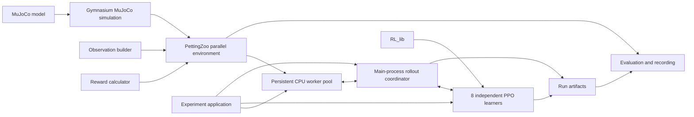

# CPU development plan

## Purpose and current position

This plan records how the first complete Centipede experiment was built on the
CPU with MuJoCo, Gymnasium, and PettingZoo. It divided the work into small,
testable stages; new complexity was added only after the preceding stage worked
and had been evaluated.

The academic focus is the emergence of cooperation between independently
trained segment agents. The MuJoCo model is complete and frozen as the v1
physical baseline described in [model.md](../docs/model.md). The shared task
contract lives in [control.md](../docs/control.md) and
[environment.md](../docs/environment.md); this plan covers only how the CPU
implementation realizes it.

**Current position: complete through Stage 9.** The simulation, public
environment, eight independent PPO learners, multiprocess collection,
checkpoints, and frozen evaluation are implemented and tested, and Stage 9
replaced the launcher with a single plan-file command. The `cpu-stage8` Git tag
preserves the implementation before that change. Training produced early local
adaptation: the rear segments learned to avoid contact, and shorter update
windows produced much stronger posture learning within the same transition
budget. It did not produce whole-body standing or target-directed walking.

Benchmarks reached roughly 50 transitions per second, so further CPU tuning was
deferred and substantial training moved to the
[GPU implementation](../gpu/plan.md). The CPU implementation remains the
correctness reference for that work. Any later CPU work will be added as a new
numbered stage.

### Configuration names

The configuration uses `rollout_window_steps` for the transitions collected
from each environment before an update, `update_cycles` for the number of
collect-and-update cycles, and `max_episode_steps` for the episode limit. The
first two replaced the less descriptive `steps_per_environment` and
`rollout_windows`. Runs saved before the rename remain readable: the snapshot
and checkpoint loaders translate the earlier names.

## Principles

- Keep the first experiment narrow enough to debug and explain.
- Give every component one clear responsibility.
- Keep all eight learners independent: no shared networks, samples, gradients,
  losses, normalization state, or centralized critic.
- Reuse Gymnasium's `MujocoEnv` for simulation lifecycle and rendering, and use
  PettingZoo's parallel API for simultaneous multi-agent interaction.
- Reuse algorithms, policies, models, and data structures from `RL_lib`; keep
  experiment composition inside Centipede.
- Validate mechanics and data flow before attempting learning.
- Change one experimental factor at a time and retain the earlier version as a
  comparison.
- Evaluate task performance and biological gait resemblance separately.

## Architecture

### Components



The boxes are responsibilities, not a requirement for one class or file per box.
Observation and reward calculations remain small pure functions in the
environment package, and the rollout coordinator and experiment application stay
separate only where that keeps them clear.

| Component | Responsibility | Must not own |
| --- | --- | --- |
| MuJoCo model | Frozen body, joints, actuators, contacts, and physical parameters | Learning or reward logic |
| Gymnasium simulation | Extend `MujocoEnv` to load the XML, resolve named indices, assemble controls, advance physics, reset physical state, collect agreed raw contact/state data, and render | Targets, task episodes, partial observations, rewards, or PPO |
| Observation builder | Convert trusted physical and task state into one raw partial observation per segment | Physics stepping, observation normalization, or policy updates |
| Reward calculator | Evaluate the agreed equations from a trusted transition and task events | Contact detection, episode decisions, or network state |
| PettingZoo environment | Wrap the Gymnasium simulation; own target state, the episode clock, arrival/failure decisions, per-agent spaces, action routing, observations, rewards, flags, and task-event information | Configuration-file parsing, PPO internals, or experiment output |
| CPU worker pool | Keep environment replicas alive in child processes, apply commands, and return ordered transition results | Learners, PPO updates, rollout buffers, reward rules, or CUDA state |
| Rollout coordinator | Batch policy queries, dispatch actions to workers, route each returned transition into its agent's isolated buffer, and distinguish environment endings from optimization-window cutoffs | Environment rules, process-local MuJoCo state, repeated input validation, PPO equations, or shared optimization data |
| Learners | Maintain and update eight independent PPO instances, normalizers, and algorithm state using `RL_lib` | MuJoCo names, environment lifecycle, or rendering |
| Experiment application | Load one experiment configuration, derive component and learner seeds, construct objects, run train/evaluate commands, and write checkpoint bundles and metrics | Physics, task rules, or PPO mathematics |
| Evaluation and recording | Load frozen learner and normalization state, consume environment task events, aggregate metrics, and collect rendered frames | Training updates or independent copies of success/contact rules |

### Framework composition

The environment uses composition rather than multiple inheritance:

```text
CentipedeParallelEnv (PettingZoo ParallelEnv, public training API)
`-- CentipedeSimulation (Gymnasium MujocoEnv, internal simulator)
    `-- configured MuJoCo XML (v1: models/assembly.xml)
```

`CentipedeSimulation` uses the services already supplied by `MujocoEnv`:
`model`, `data`, `frame_skip`, `dt`, state/reset support, simulation stepping,
render modes, and resource cleanup. Centipede-specific code is limited to the
model path, named index mappings, the initial state, conversion of the enabled
leg action into the complete MuJoCo control vector, and the raw transition data
needed by the public environment. The seven spine controls remain zero.

The experiment configuration supplies the model path. `MujocoEnv` loads and
compiles that file once when `CentipedeSimulation` is constructed; subsequent
steps use the resulting `model`, `data`, and cached named mappings. The
simulation derives its controlled segment IDs from the loaded model's actuator
ownership metadata rather than hardcoding eight. The v1 task configuration still
validates that the selected baseline exposes segment IDs `0` through `7`.

Although it subclasses `MujocoEnv` to reuse those services, the simulation is not
a second public single-agent task. It does not invent a reward, target, episode
limit, or task termination merely to behave like the public environment. Its
physics-facing methods receive trusted controls and return physical state; the
Gymnasium transition it returns has neutral rewards and endings. Gymnasium
defines one `MujocoEnv` step as `model.opt.timestep * frame_skip`, which gives
the shared 20 ms control interval with `frame_skip=200`. The simulation declares
`render_fps` as 50 to match it. Ordinary training remains unrendered.

`CentipedeParallelEnv` is the only environment used by the rollout coordinator.
It follows PettingZoo's `ParallelEnv` contract: `possible_agents` is
`[0, 1, 2, 3, 4, 5, 6, 7]`, `reset()` and `step()` return dictionaries keyed by
those identifiers, and all agents remain active together. Every per-agent action
space is a Gymnasium `Box` with shape `(6,)`, `float32` values, and bounds
`[-1, 1]`; every observation space is an unbounded `float32` `Box` with the shape
defined in [control.md](../docs/control.md). A `step()` call maps the
simultaneous action dictionary into the joint 48-value leg action, calls the
internal simulation once, builds partial observations, evaluates shared and local
reward terms, and returns per-agent termination, truncation, and information
dictionaries. The internal simulation expands the 48 leg commands into the
model's 55-value control vector and writes zero to each spine actuator.
Rendering and closing are delegated to `CentipedeSimulation`.

The PettingZoo environment is an application boundary, not a communication
mechanism between policies. Its dictionaries route independent values by agent;
they do not imply shared networks, buffers, gradients, or losses. The public
environment does not import PPO, and PPO does not depend on MuJoCo joint or
actuator names. Training and evaluation use the same parallel environment, but
evaluation never updates a learner.

This is the same broad composition used by Farama's MaMuJoCo: a PettingZoo
parallel environment containing an underlying Gymnasium MuJoCo environment. The
project keeps its own thin wrapper because the target observation, segment
blocks, contact flags, disabled spine actions, and local reward terms are
specific to this project. MaMuJoCo is a design reference, not a dependency.

### Validation ownership

Data is validated once at the boundary that first accepts it, converted into a
trusted internal representation, and relied on downstream. This keeps failures
close to their source and prevents different copies of the same rule from
drifting apart.

| Input or invariant | Single owner | When it is checked |
| --- | --- | --- |
| Experiment configuration and parameter relationships | Configuration loader | Once, before constructing the experiment |
| XML actuator names, ownership metadata, attached joints, limits, and counts | `CentipedeSimulation` | Once, during initialization |
| PettingZoo action keys, value shapes, numeric conversion, finiteness, and bounds | `CentipedeParallelEnv.step()` | Once, at the public runtime boundary before state changes |
| Conversion from eight accepted actions to the trusted 48-value leg vector | `CentipedeParallelEnv` | During the accepted step |
| Conversion from the trusted leg vector to the 55-value MuJoCo control vector | `CentipedeSimulation` | Immediately before simulation; cached actuator IDs are reused |
| MuJoCo control-vector shape | Gymnasium `MujocoEnv` | In its existing simulation call |
| Post-step numerical validity | `CentipedeSimulation` | Once after the physical transition |
| Observation layout | Observation builder | Produced from trusted simulation state; verified by tests |
| Reward equations and ownership | Reward calculator | Produced from trusted transition data; verified by tests |
| PPO samples, shapes, and update requirements | `RL_lib` | At its existing public library boundaries |

`step()` rejects an action dictionary whose keys are not exactly the eight active
segment IDs, whose values cannot be represented as `float32` arrays of shape
`(6,)`, or whose components are not finite values in `[-1, 1]`. It raises a
clear exception before any physics step occurs. Actions are never silently
clipped: clipping would hide policy or runner errors and could make the executed
action differ from the one stored for PPO probability calculations.

The rollout coordinator does not duplicate action validation; it submits policy
outputs to the public parallel environment. Observation and reward helpers do not
revalidate the XML or raw action dictionary. If an internal invariant fails, that
is a programming error to fix at its owner rather than an input to repair in
several downstream modules.

The `cpu/tests/` directory owns automated verification. Tests may construct
controlled valid, boundary, and invalid inputs, but test fixtures and diagnostic
helpers are never imported by `cpu/src/centipede`.

| Test file | Scope |
| --- | --- |
| `tests/environment/test_simulation.py` | XML contract, cached mapping, reset, control assembly, timing, finite state, and rendering lifecycle where practical |
| `tests/environment/test_environment.py` | PettingZoo API, agent lifetime, action-boundary rejection, simultaneous stepping, termination, and truncation |
| `tests/environment/test_observations.py` | Exact per-agent layouts and coordinate transformations from controlled states |
| `tests/environment/test_rewards.py` | Shared and local terms from controlled transitions and contact events |
| `tests/training/` | Learner construction, environment pools, rollout coordination, and checkpoints |
| `tests/experiment/` | Configuration, runner, evaluation, reports, and the command-line launcher |

PettingZoo's `parallel_api_test` verifies the public environment. The internal
simulation receives focused reset, mapping, stepping, numerical, and rendering
tests instead of Gymnasium's full environment checker: requiring a complete
single-agent task interface there would duplicate or invent the reward and
episode semantics owned by the PettingZoo environment.

### State and data ownership

Several values cross component boundaries without transferring ownership:

- The experiment entry point loads the selected configuration once. Constructed
  components receive only the values they need and never reopen or reinterpret
  the configuration file.
- `CentipedeParallelEnv.reset(seed=...)` is the sole episode-reset entry point.
  It derives deterministic child random streams for the physical reset and target
  sampling, then asks `CentipedeSimulation` to reset only the physical state.
  This prevents target sampling order from changing physical initialization.
- `CentipedeSimulation` is the only component that reads MuJoCo contacts and raw
  body/joint arrays. It returns an immutable `float64` `PhysicalSnapshot` copy
  after reset and after every transition. The public environment keeps only the
  previous and current snapshot and owns the meaning of those signals for
  observations, rewards, failure, and task events.
- The public environment owns elapsed episode time, arrival, termination, and
  truncation. The rollout coordinator consumes those results; it does not impose
  a second episode limit. A fixed PPO rollout-window boundary stops collection
  for an update but does not terminate or reset the environment.
- The environment emits raw observations in its declared spaces. Each learner's
  `RL_lib` normalizer owns normalization and its saved state. Evaluation restores
  and uses that state instead of fitting or normalizing inside the environment.
- The environment exposes agreed task events and primitive measurements in
  `info`. Evaluation aggregates them across fixed episodes; it does not inspect
  MuJoCo directly or reimplement arrival, contact, or failure detection.
- Learner state consists of one PPO instance, normalizer, and rollout buffer per
  agent ID. The experiment application holds these eight records in a simple
  dictionary, while the coordinator only routes values and triggers updates.
  Records are never pooled; no learner-management framework is required.
- Every worker owns complete environment replicas and their MuJoCo state. The
  main process owns all learners, normalizers, trajectory fragments, updates,
  checkpoints, and progress reporting. Workers exchange only trusted actions and
  transition results; they never receive models, optimizers, or CUDA tensors.
- A worker returns the final observation and ending flags before an ended
  environment is reset. This preserves correct termination bootstrapping and
  prevents an initial reset observation from being mistaken for a terminal one.
- Environment seeds are derived from the root training seed and stable replica
  indices, not process IDs or completion order. Changing the worker count does
  not change which tasks the replicas receive.
- Checkpoint bundling and run-directory layout belong to the experiment
  application. `RL_lib` supplies individual algorithm state, and evaluation only
  reads a completed bundle. A generic checkpoint subsystem is unnecessary.

The named records that carry this data are listed in
[data-types.md](data-types.md).

### RL_lib integration

An audit on 2026-08-31 inspected both the reusable package under
`../RL_lib/src/rl_lib` and the reference applications under
`../RL_lib/experiments`. It made no changes to RL_lib.

Only `src/rl_lib` is a dependency of Centipede. It provides the generic building
blocks: PPO, Gaussian policies, actor and value models, PPO action samples,
observation normalization, generalized advantage estimation, and update results.
The existing experiment runners demonstrate how those pieces can be used, but
are not library interfaces and are not imported. Centipede implements the whole
application level anew:

- MuJoCo environment and simultaneous segment actions.
- Construction of eight independent PPO instances.
- Per-agent observation and reward routing.
- Fixed-length rollout coordination and episode continuation.
- Experiment configuration, seeding, training loop, and progress reporting.
- Project checkpoint bundles, evaluation metrics, and recordings.

| Requirement | Status |
| --- | --- |
| Bounded continuous PPO | Implemented with a tanh-squashed diagonal Gaussian and correct latent-action probability evaluation. |
| Six-value leg actions | Supported by arbitrary fixed-size Gaussian policy outputs and finite per-component bounds. |
| Independent learners | Supported by constructing eight separate PPO objects with separate models, optimizers, normalizers, seeds, and samples. |
| Rollout representation | `EpisodeStep` and `rollout_arrays` store and validate normalized observations, environment actions, latent continuous-policy actions, rewards, and the final state. Centipede only adds the frozen log probabilities and values required by PPO. |
| Partial-rollout updates | Already supported by the algorithm primitives: `PPO.update` accepts arbitrary fixed batches, `PPO.state_value` supplies a boundary bootstrap, and `generalized_advantage_estimates` handles terminal versus nonterminal boundaries. |
| PPO minibatch reuse | Implemented with frozen old log probabilities and targets, full-batch advantage normalization, shuffled epochs, and minibatches. |
| Deterministic evaluation actions | Implemented by selecting the bounded Gaussian mean. |

The RL_lib PPO experiment runner collects complete episodes, but that is not a
limitation of the PPO algorithm. Centipede's runner ends a collection window
without ending the environment, bootstraps each learner from its own critic,
updates each learner independently, and resumes from the same MuJoCo state. The
targeted PPO and environment suite passed 100 tests, and an artifact-free
continuous PPO run on `Pendulum-v1` completed.

The coordinator holds the eight rollout buffers in a dictionary keyed by segment
ID; separate ownership does not require eight custom runner or buffer classes.
Each buffer uses RL_lib's `EpisodeStep` and `rollout_arrays`; its thin Centipede
wrapper stores only the PPO log probabilities and critic values absent from that
generic rollout type. The coordinator routes transitions and triggers updates but
does not recompute environment termination, truncate the episode at a rollout
boundary, or implement PPO math.

No RL_lib source change was required for the CPU implementation. The audit
recorded possible later generic gaps, to be evaluated only when needed:

- The package has no explicit CPU/CUDA device selection; all PPO tensors and
  models remain on CPU.
- A recurrent experiment would require generic recurrent models, policies, and
  sequence-aware PPO data.
- A generic checkpoint abstraction may be useful eventually, but the eight-agent
  checkpoint bundle is Centipede application composition and belongs here.

## Stages

Each stage has one goal and a scope: the layer and files it created or changed.
Package paths are relative to `cpu/src/centipede/`; other paths are relative to
`cpu/`.

### Stage 1 — Freeze the first interface

**Goal:** define exact contracts before implementing the environment.

**Scope:** the shared contract documents, `control.md` and `environment.md` in
the root `docs/` folder; no code.

The contract covers action ordering, range, and ownership; observation ordering,
dimensions, units, and coordinate frames; shared and local reward terms;
contact-event aggregation over one control interval; initial pose and reset
randomization; arrival, termination, truncation, and numerical-failure behavior;
and physics steps per action with the resulting control frequency. A contract is
ready when an implementation can be written without guessing an index,
reference frame, unit, or episode rule.

**Complete when:**

- Every action and observation element has an exact definition.
- Head, rear, and interior observation dimensions are known.
- Reward equations and event ownership are explicit.
- Reset and episode boundaries are deterministic for a fixed seed.
- Proposed constants are clearly marked and accepted before use.

**Result:** passed. The accepted contract is recorded in
[control.md](../docs/control.md) and [environment.md](../docs/environment.md):

- Segment identifiers are the integers `0` through `7`, from head to rear, each
  with six normalized leg actions. Invalid actions raise instead of being
  silently clipped.
- Actuator IDs are resolved by canonical MuJoCo names and cross-checked against
  ownership metadata; XML element order is never used as the policy mapping.
- The 0.1 ms physics timestep with 200 steps per action gives a 20 ms transition
  and 50 Hz control.
- Every segment has a 27-value state block. The head, interior, and rear
  observation shapes are `(56,)`, `(81,)`, and `(54,)`; only the head receives
  target displacement.
- Physical reset randomizes only leg angles and velocities; the close forward
  target is sampled independently.
- Arrival terminates all agents; the configured episode limit truncates them.
- Rewards contain one shared arrival term and local efficiency, body-contact, and
  leg-contact costs.

### Stage 2 — Simulation and environment without learning

**Goal:** implement `CentipedeSimulation` and `CentipedeParallelEnv` and exercise
them with zero, fixed, and seeded-random actions, without PPO.

**Scope:** `environment/simulation.py` and `environment/parallel_env.py`, with
`tests/environment/test_simulation.py` and `test_environment.py`.

The simulation loads its configured XML once, resets the body, assembles the
complete control vector, advances one control interval, and supports Gymnasium
rendering and cleanup. The parallel environment defines the eight agents and
their spaces, accepts one six-value action from each agent, maps those actions
simultaneously, and returns eight observations, rewards, termination flags,
truncation flags, and information dictionaries. Spine commands stay at zero, and
target, partial-observation, and per-agent reward logic stays outside the
simulation class.

**Complete when:**

- The model runs without invalid state or solver warnings in short checks.
- Reset produces the same state for the same seed.
- Each action controls only the intended segment legs.
- Spine motors remain at zero.
- Observations and rewards contain finite values with the expected shapes.
- Focused simulation tests pass, and PettingZoo's parallel API test passes for
  the public environment contract.

**Result:** passed.

### Stage 3 — Validate observations and rewards

**Goal:** test behavior at the public environment boundary for the head, one
interior segment, and the rear.

**Scope:** `environment/observations.py` and `environment/rewards.py`, with
`tests/environment/test_observations.py` and `test_rewards.py`.

The checks establish that head and rear agents receive self plus their one
existing neighbor; interior agents receive complete self, ahead, and behind
blocks in a consistent order; contact flags identify the correct segment owners;
only the head observes the target; head distance-ratio and local path-following
costs have the correct scale and direction; arrival reward is copied to all
eight learners; local penalties affect only the participating agents; and local
observations behave correctly under changes in world position and yaw. Reset,
arrival, and timeout have distinct meanings, and an invalid numerical state
raises an exception instead of masquerading as an episode ending.

**Complete when:** all interface checks pass for the head, one interior segment,
and the rear segment, including deliberately induced contact and episode events.

**Result:** passed. The checks cover exact observation blocks and target-frame
behavior, head and follower reward scales, contact ownership and local costs,
shared arrival, timeout, and numerical failures that raise rather than becoming
ordinary episode endings. Short nonzero action checks remain finite. They verify
the component contracts, not learned walking or a wave-like gait.

### Stage 4 — Integrate independent PPO learners

**Goal:** create eight separate PPO instances from `RL_lib` and connect them to
the environment.

**Scope:** `training/learners.py`, `training/rollout.py`, and
`training/checkpoints.py`, with their tests.

Every segment has its own actor, critic, optimizers, observation normalizer,
rollout samples, advantages, targets, losses, and checkpoint state. The rollout
coordinator collects one synchronized fixed-length window while the policies
remain frozen, then gives each learner only that segment's samples. At a
nonterminal window boundary, each learner bootstraps from its own critic; at a
true terminal boundary, its final bootstrap value is zero. The learner settings
are recorded in [control.md](../docs/control.md). Learner construction, rollout
coordination, and synchronized checkpoints live under
`cpu/src/centipede/training/`.

**Complete when:**

- A short rollout and PPO update complete for every segment.
- Object and storage checks show no accidental parameter, optimizer, normalizer,
  or buffer sharing.
- Rollout truncation uses critic bootstrapping, while true termination does not.
- Saving and restoring all eight learner states reproduces their outputs.

**Result:** passed, including one short MuJoCo rollout followed by real PPO
updates for all eight learners. This verifies the integration path, not learned
walking or training stability over a long run.

### Stage 5 — Single-environment training smoke test

**Goal:** verify that one complete training run executes correctly. A working
runner and finite PPO updates, rather than policy improvement, pass this stage.

**Scope:** `experiment/config.py`, `experiment/presets.py`, and
`experiment/runner.py`; the launcher (`run.cmd` and `tools/run_experiment.py`);
and `configs/smoke.toml`.

The task removes unnecessary variation: flat ground, the standard initial pose, a
close target within a narrow forward region, six leg actions per segment with no
spine actions or observations, an observation radius of one, and episodes that
end on arrival or time limit. It uses the recorded Stage 1 reward without
training-specific shaping. The smoke configuration selects one environment, four
rollout windows of 256 steps each, one recorded training seed, and two fixed
evaluation seeds.

**Complete when:**

- The run completes all four windows and 1,024 environment transitions without a
  non-finite update.
- All eight independent learners are present in each synchronized checkpoint;
  their parameters are finite and change during the run.
- No claim of improved navigation, cooperation, or walking is made from the
  training run alone.

**Result:** passed for the single-environment smoke run. Its first frozen
evaluation found reduced rear-segment contact, but no arrivals and almost no head
movement on two held-out seeds.

### Stage 6 — Early learning evaluation

**Goal:** determine whether training changes behavior in a useful direction at
all. Locomotion is not required.

**Scope:** `experiment/evaluation.py`, `experiment/report.py`, the launcher's
evaluation path, and `configs/evaluation.toml`.

Because the smoke run showed almost no head movement, a second profile allowed a
longer episode while keeping the model, reward, seed, learner settings, and PPO
window unchanged: eight windows of 256 transitions and a 2,048-step limit.
Evaluation compares contact frequency and movement as well as return, because
longer episodes accumulate more reward terms. It uses:

- Synchronized checkpoints that restore all eight learners and their
  normalization states.
- Frozen-policy evaluation that updates neither networks nor normalizers.
- One stable diagnostic result per checkpoint, with per-episode records and a
  summary.
- The same held-out episodes for every checkpoint, plus zero-action and
  random-action baselines. Checkpoint policies act deterministically; the random
  baseline uses a seeded stream per episode.
- Undiscounted return for the head and followers separately, with success,
  initial and final target distance, and head path length, plus time to target,
  body and leg contacts, and action magnitude to interpret the behavior.
- A static HTML report alongside the binary checkpoints.

The evaluation code lives under `cpu/src/centipede/experiment/` and `cpu/tools/`.
The longer run's reports are `runs/stage6_long_episode/evaluation.html` and
`evaluation_confirmation.html`; generated files remain outside version control.

**Complete when:** frozen evaluation on held-out seeds shows whether any
behavior improves relative to the baselines, without treating reward alone as
evidence of walking or cooperation.

**Result:** passed. Frozen evaluations on four held-out seeds repeatedly showed
segment 7 avoiding body-ground and leg-leg contact, while segment 6 sharply
reduced body-ground contact from checkpoint 2 to checkpoint 6 relative to zero
actions. The final checkpoint partially regressed for segment 6, and most other
segments did not improve consistently. All learned episodes reached the time
limit with little head movement. This establishes early local adaptation only.

Two controlled four-environment runs then used the same 8,192-transition budget
to compare rollout schedules. Changing from eight 256-step windows to
thirty-two 64-step windows sharply reduced head and first-follower body contact,
showing that the system can learn posture-related behavior when it receives
enough update opportunities. It did not produce whole-body standing or
target-directed walking.

### Stage 7 — Synchronous multiprocess collection

**Goal:** replace direct sequential environment stepping with a correct,
persistent CPU worker pool while preserving the behavior of Stages 1–6. This
stage proves equivalence and lifecycle safety; it does not need to improve
throughput or learning.

**Scope:** `training/environment_pool.py`, the rollout coordinator in
`training/rollout.py`, the runner, and the launcher's Windows spawn boundary.

#### Execution boundary

One small environment-pool interface sits between the rollout coordinator and the
public environments. It has four operations: reset all replicas with ordered
seeds, step all replicas with ordered action dictionaries, reset selected
replicas after episode endings, and close all owned resources. There are two
implementations:

- A serial pool containing the in-process behavior. It is the correctness
  reference and the one-process benchmark.
- A process pool using Windows' `spawn` context and persistent workers. Each
  worker owns one or more complete `CentipedeParallelEnv` instances, including
  their MuJoCo models, data, targets, episode clocks, and random generators.

The machine has four physical cores and eight logical processors. Worker count
and environment count are separate settings; replicas assigned to one worker are
stepped in a stable sequence inside it.

#### Collection order

For each control transition, the coordinator performs four ordered phases:

1. Normalize observations and sample every replica's actions in global replica
   order using the unchanged segment learners.
2. Send every worker its assigned action dictionaries before waiting for results.
3. Gather results from all workers and restore global replica order regardless
   of worker completion order.
4. Append rewards and policy measurements to the per-replica, per-agent
   fragments.

RL_lib normalizes and samples one observation at a time; this stage keeps that
API and groups the resulting actions for dispatch. Collection remains synchronous
and on-policy: every replica completes transition `t` before any replica begins
transition `t + 1`, and PPO updates begin only after all replicas contribute the
configured window. A worker returns the terminal observation without resetting;
the coordinator finalizes the fragment, using zero bootstrap for termination and
critic bootstrap for truncation, and then requests that replica's reset.

#### Configuration and process lifecycle

`worker_count` sits beside `environment_count` in the training configuration and
the resolved run snapshot; older snapshots remain readable. One temporary
reference environment in the main process derives the agent IDs and spaces for
the learner builder and is closed before workers start. Workers communicate over
persistent process connections carrying compact NumPy actions and PettingZoo
results, with a stable replica-to-worker assignment. There is no shared memory,
automatic retry, or dynamic scheduling.

The Windows launcher avoids eagerly importing learner and Torch modules when
spawned children import the main script. Worker failures, partial startup,
keyboard interruption, and normal completion all close environments, join
workers, terminate stragglers when necessary, and surface one useful main-process
error without leaving orphan processes.

**Complete when:**

- Fixed seeds and fixed actions yield equivalent ordered observations, rewards,
  endings, and diagnostics through the serial and process pools within the
  established numerical tolerance.
- Terminal observations are finalized before reset, no fragment crosses an
  episode boundary, and optimization cutoffs continue live episodes correctly.
- Every learner receives exactly `E × W` samples from its own segment for a full
  window, with no cross-agent samples, parameters, losses, or normalization.
- Two- and four-worker checks complete repeated short windows, propagate startup
  and runtime failures, and shut down without orphan processes.

**Result:** passed. Parity, reset boundaries, sample counts, error propagation,
cleanup, and the Windows spawn import boundary are covered by automated tests. A
manual launcher smoke run completed one 256-step window with two environments on
two workers, saved all eight learners, and recorded 512 finite transitions. These
checks establish collector correctness and lifecycle safety only.

### Stage 8 — CPU performance reference

**Goal:** establish a measured CPU execution reference. The scope was revised
after both benchmarks: further CPU thread tuning and broad profiling were
deferred, and batched inference moved to the GPU learner work. This stage makes
no learning claim.

**Scope:** the launcher's benchmark mode and `configs/benchmark_cpu.toml`, both
replaced by comparison plans in Stage 9.

Benchmarking is orchestration owned by the terminal launcher. It derives normal
training presets and passes every case to the unchanged `run_training` function;
it adds no runner, collector, pool, or benchmark module. One reusable TOML owns
the matrix. The launcher records each complete training call's wall time,
seconds per window, transition count, and transitions per second in incremental
JSON and Markdown reports.

| Dimension | Values |
| --- | --- |
| Environment replicas | `4`, `8`, `16`, `32` |
| CPU workers | `1`, `2`, `4`, `8` |
| Rollout window length per environment | `64`, `128`, `256`, `512` |
| Episode limit | `256`, `2,048`, `8,192` |

The matrix is progressive rather than a full Cartesian product. It first compares
every valid worker count for each environment count at the 256-step rollout and
2,048-step episode baselines, then reuses each environment count's fastest worker
layout for the remaining rollout sizes, and finally compares episode limits only
with 32 environments and that group's selected worker count.

The first 29-case benchmark completed without errors. Four workers won for four
environments; eight workers won for 8, 16, and 32 environments. At 32
environments, eight workers completed the baseline 256-step window in 185.27 s,
versus 234.04 s with four workers. Later 32-environment cases reached roughly
50–52 transitions/s. A follow-up of six cases compared 32 and 64 environments
with 6, 8, and 16 workers, a 256-step window, an 8,192-step episode limit, and
two update cycles.

| Retained reference | Environments | Workers | Rollout steps | Transitions/s |
| --- | ---: | ---: | ---: | ---: |
| Best extended-run candidate | 32 | 16 | 256 | 51.06 |
| Earlier baseline, extended run | 32 | 8 | 256 | 39.74 |
| Larger-batch alternative | 64 | 6 | 256 | 49.85 |
| Small local check, first run | 4 | 4 | 256 | 26.56 |

Sixteen workers reduced elapsed time by about 22% relative to eight workers for
32 environments in the extended run, and 64 environments did not improve on the
best 32-environment result. These are measured candidates, not universal optima:
the 32-environment, eight-worker case measured 52.15 transitions/s in the first
run but 39.74 in the second, with different update-cycle counts and one
repetition each. They are whole-run measurements, including startup, collection,
updates, checkpoint writing, and shutdown; they do not identify the dominant
phase. Short 256-step runs also cannot establish the sustained cost of 2,048- or
8,192-step episodes, since neither limit is reached. The approximate 5.6-hour
projection for 1,048,576 transitions is provisional.

The reports are `runs/benchmarks/20260923T141432Z-c24c2d1c/benchmark_report.md`
and `runs/benchmarks/20260923T153437Z-5bf25598/benchmark_report.md`.

**Complete when:** both reports are reviewed and the useful configurations and
limitations are recorded.

**Result:** passed under the revised scope. No phase-level bottleneck,
sustained-run speedup, or learning improvement has been demonstrated. CPU
optimization is deferred in favor of the GPU execution path.

### Stage 9 — Plan-file command line

**Goal:** run every experiment from one TOML plan file whose `kind` selects the
operation, replacing the flag-based launcher and its separate benchmark mode.

**Scope:** `cli.py` and `__main__.py`, plan loading in
`experiment/presets.py`, the new `experiment/workflows.py`, `run.cmd`, the
console script in `pyproject.toml`, the plan files in `configs/`, and
`tests/experiment/test_cli.py` and `test_config.py`.

The earlier launcher chose its operation from four flags with hand-written rules
about valid combinations, while the settings lived in TOML files, and about 350
of its 443 lines were a CPU-specific benchmark with its own parser and
progressive selection algorithm. The replacement takes a single plan path:

| `kind` | Operation |
| --- | --- |
| `training` | Train a new run; its optional `[evaluation]` seeds evaluate that run afterwards |
| `evaluation` | Evaluate an existing `source` run with its saved training settings |
| `comparison` | Train, and optionally evaluate, every variant of a `base` training plan and report them together |

A comparison lists either a `[grid]` of values, expanded into every
combination, or explicit `[[variant]]` tables for settings that change
together. Variants may change only `[training]`, `[learner]`, and `[rollout]`
fields, and every merged variant passes through the ordinary training schema
before the first run starts. Execution benchmarks and hyperparameter
comparisons therefore share one mechanism; the automatic selection of a fastest
worker layout was removed in favor of reading the comparison table.

Responsibilities follow the validation rule: `load_plan` is the only component
that checks plan files and returns trusted plan objects; `workflows.py` creates
result directories, copies the plan, and calls the unchanged runner,
evaluation, and report modules; `cli.py` only loads the plan and passes it to
the workflow for its kind. `python -m centipede` is the entry point, and
`run.cmd` wraps it with the Centipede interpreter. Spawned workers do not re-run
a package's `__main__` module, so no deferred imports are needed for Windows
multiprocessing.

**Complete when:** every plan in `configs/` loads with its declared kind, each
kind is routed to its workflow, invalid plan files fail before any work starts,
comparisons record failed variants and continue, and the full CPU suite passes.

**Result:** passed. Focused tests cover all three kinds, grid expansion, explicit
variants, rejected plan files, failure recording, and the package entry point;
the full suite passed with 139 tests. The launcher's help and a rejected plan
were checked from PowerShell. No training or evaluation run was launched.

## Maintaining this plan

Record any later CPU work as a new numbered stage
with its own goal, completion gate, and result. Do not mark a stage complete
because code exists; record the checks that demonstrate its completion. Detailed
model, control, and task decisions remain in the shared documents rather than
being duplicated here.

## References

- [Gymnasium `Env` API](https://gymnasium.farama.org/api/env/)
- [Gymnasium MuJoCo environments](https://gymnasium.farama.org/environments/mujoco/)
- [PettingZoo parallel API](https://pettingzoo.farama.org/api/parallel/)
- [Gymnasium `AsyncVectorEnv`](https://gymnasium.farama.org/main/api/vector/async_vector_env/),
  used as a multiprocessing design reference rather than a direct multi-agent
  wrapper
- [Python multiprocessing contexts](https://docs.python.org/3/library/multiprocessing.html#contexts-and-start-methods)
- [PyTorch multiprocessing guidance](https://docs.pytorch.org/docs/stable/notes/multiprocessing.html)
- [Gymnasium-Robotics MaMuJoCo](https://robotics.farama.org/envs/MaMuJoCo/)
  and its [composition source](https://github.com/Farama-Foundation/Gymnasium-Robotics/blob/main/gymnasium_robotics/envs/multiagent_mujoco/mujoco_multi.py),
  retained as references rather than dependencies
