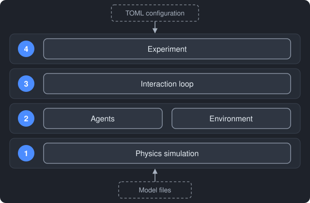
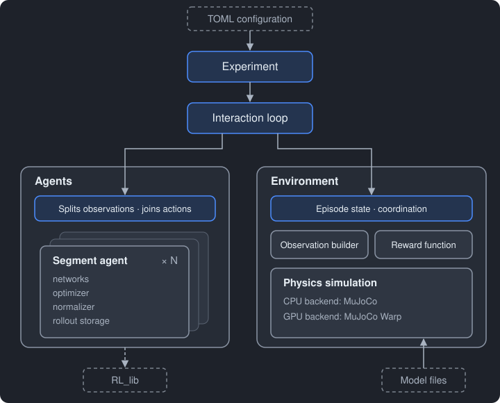

# Project architecture

Centipede trains a simulated centipede to walk. Each of its eight body segments
is an independent reinforcement-learning agent, and the segments cooperate only
through the shared body.

The program follows the basic model of reinforcement learning: **agents** choose
actions, an **environment** responds with observations and rewards, and the two
repeat this exchange. It is built as a pipeline of independent components. Each
component has one clear job, uses only the component below it, and offers a
small set of operations to the component above.

You work only at the two ends of the pipeline. At the top, you run one command
with a TOML configuration file that holds every setting of a run. At the bottom,
the model files describe the body; the configuration says which one to load.
Everything in between runs on its own.

## Layers

**Layer 4: Experiment.** Turns your command into a run: reads the
configuration, starts training or evaluation, and saves the results. It is the
only layer that deals with files.

**Layer 3: Interaction loop.** Makes the agents and the environment
communicate, one step at a time, and decides when the agents learn from what
they have collected.

**Layer 2: Agents and environment.** The two sides of the reinforcement-learning
problem, side by side. The environment is the problem; the agents try to solve
it. They never talk to each other directly.

**Layer 1: Physics simulation.** Moves the body. It runs on the CPU or the GPU,
and the layers above cannot tell which. Only the environment uses it.

## Components

A box inside another box is an internal part of that component. Blue boxes are
the parts the layer above talks to: the front of each component. Dashed boxes
are outside the pipeline. Arrows point from a component to the one it calls.
What passes along each connection:

| Connection | Going down | Coming back |
| --- | --- | --- |
| Experiment ↔ Interaction loop | Settings | Episode statistics, agent state for checkpoints |
| Interaction loop ↔ Agents | Observations, rewards, episode ends | Joint action |
| Interaction loop ↔ Environment | Joint action | Observations, rewards, episode ends |
| Environment ↔ Physics simulation | Leg actions, reset requests | Physical state |

Each component is one folder under `src/centipede/`. In every folder, the file
named like the folder is the **front file**: it offers the component's operations
to the layer above and manages the other files, which are internal. Each
component owns and checks its own section of the configuration file, using the
shared helper `src/centipede/settings_section.py` so that the checks are written
once. Data passed
between components is PyTorch tensors; inside a component, NumPy may be used
where simpler.

### Experiment

The entry point of the program. It reads the TOML configuration, hands each
component its section, runs training or evaluation through the interaction loop,
and saves what the run produces. Each run gets its own folder under `runs/`,
holding the configuration it used, its logs, and its checkpoints.

Every configuration file has a `mode`. **Train** files start a new run or
continue an earlier one; smoke tests, probe tests, and full training use the
same code and differ only in their values. **Evaluate** files test a saved run
on fixed seeds, alongside zero-action and random-action baselines, and write the
results into that run's folder. The layout of these files is described in
[configuration.md](configuration.md).

**Files:** `experiment.py` (front file: the command you run),
`configuration.py` (reading the TOML file and splitting it into sections), and
`run_folder.py` (creating a run's folder and writing into it). Reusable
configuration files live in `configs/`.

### Interaction loop

The exchange between agents and environment. It gives observations to the
agents, passes their joint action to the environment, and returns the results to
the agents. It counts steps, tells the agents to learn at the end of every
collection window (which never resets the environment), and records episode
statistics such as returns and lengths. It calculates nothing itself. Evaluation
uses the same loop without recording or learning.

**Files:** `interaction_loop.py` (front file: `train()` and `evaluate()`) and
`settings.py`, which holds `rollout_window_steps` (steps per world before each
update, first value 256) and `update_cycles` (number of collect-and-learn
cycles, first value 128).

### Agents

One segment agent per body segment (eight in v1), managed as one group. Each
has its own networks, optimizers, observation normaliser, and stored data, and
learns only from its own data with PPO from the shared `RL_lib` library. The
group splits the observations among its segment agents and joins their actions
into one joint action.

**Details:** [agents.md](agents.md)

### Environment

The problem the agents must solve. `reset` starts new episodes, and `step` takes a
joint action and returns the next observations, one reward per segment, and which
episodes ended. Its front file keeps the episode state (targets, step counts,
previous positions) and coordinates its parts: the observation builder, the
reward function, and the physics simulation. It does not store data for
learning.

**Details:** [environment.md](environment.md)

### Physics simulation

Part of the environment, in `environment/simulation/`. It loads the model, finds
each segment's motors and contact shapes by name, applies leg actions, advances
the physics, resets worlds, and reports the physical state. A CPU backend uses
MuJoCo and a GPU backend uses MuJoCo Warp; the configuration chooses one, and
nothing outside the simulation can tell the difference.

**Details:** [environment.md](environment.md#physics-simulation)

### Model

The centipede's body: MuJoCo XML files describing its shape, joints, motors,
masses, and contacts. It contains no program logic and is not part of the
pipeline. It is frozen; the configuration names the file to load.

**Details:** [model.md](model.md)
