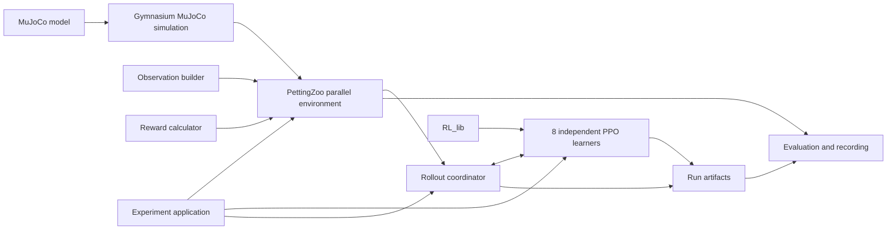

# Development plan

## Purpose

This roadmap divides the Centipede project into small, testable stages. The
first objective is a complete but simple reinforcement-learning experiment. New
complexity is added only after the preceding stage works and has been evaluated.

The academic focus is the emergence of cooperation between independently
trained segment agents. The MuJoCo model is already complete and frozen as the
v1 physical baseline. The simulation and public environment are implemented,
but no learned policy exists yet.

**Current position:** Stages 1 and 2 are complete, and Stage 3 is next. The public
actions and observations, physical snapshot, reset, target, rewards, episode
boundaries, error behavior, and 20 ms control interval have first-version
implementations and passing focused checks. Reward coefficients and numerical
movement tolerances remain initial experiment settings to validate before
training.

## Design principles

- Keep the first experiment narrow enough to debug and explain.
- Give every component one clear responsibility.
- Keep all eight learners independent: no shared networks, samples, gradients,
  losses, normalization state, or centralized critic.
- Reuse Gymnasium's `MujocoEnv` for simulation lifecycle and rendering, and use
  PettingZoo's parallel API for simultaneous multi-agent interaction.
- Reuse algorithms, policies, models, and data structures from `RL_lib`; keep
  experiment composition inside Centipede.
- Validate mechanics and data flow before attempting learning.
- Change one experimental factor at a time and retain the earlier version as a
  comparison.
- Evaluate task performance and biological gait resemblance separately.
- Treat proposals in this document as adjustable until their stage begins and
  the user accepts them.

## Component boundaries



The boundaries are conceptual. They do not require one class or file for every
box if a smaller implementation remains clear.

| Component | Responsibility | Must not own |
| --- | --- | --- |
| MuJoCo model | Frozen body, joints, actuators, contacts, and physical parameters | Learning or reward logic |
| Gymnasium simulation | Extend `MujocoEnv` to load the XML, resolve named indices, assemble controls, advance physics, reset physical state, collect agreed raw contact/state data, and render | Targets, task episodes, partial observations, rewards, or PPO |
| Observation builder | Convert trusted physical and task state into one raw partial observation per segment | Physics stepping, observation normalization, or policy updates |
| Reward calculator | Evaluate the agreed equations from a trusted transition and task events | Contact detection, episode decisions, or network state |
| PettingZoo environment | Wrap the Gymnasium simulation; own target state, the episode clock, arrival/failure decisions, per-agent spaces, action routing, observations, rewards, flags, and task-event information | Configuration-file parsing, PPO internals, or experiment output |
| Rollout coordinator | Query all policies, apply simultaneous actions, route each result to its agent's isolated rollout buffer, and distinguish environment endings from optimization-window cutoffs | Environment rules, repeated input validation, PPO equations, or shared optimization data |
| Learners | Maintain and update eight independent PPO instances, normalizers, and algorithm state using `RL_lib` | MuJoCo names, environment lifecycle, or rendering |
| Experiment application | Load one experiment configuration, derive component and learner seeds, construct objects, run train/evaluate commands, and write checkpoint bundles and metrics | Physics, task rules, or PPO mathematics |
| Evaluation and recording | Load frozen learner and normalization state, consume environment task events, aggregate metrics, and collect rendered frames | Training updates or independent copies of success/contact rules |

### Framework composition

Use composition rather than multiple inheritance:

```text
CentipedeParallelEnv (PettingZoo ParallelEnv, public training API)
`-- CentipedeSimulation (Gymnasium MujocoEnv, internal simulator)
    `-- configured MuJoCo XML (v1: models/assembly.xml)
```

`CentipedeSimulation` replaces the previously proposed custom physics adapter.
It should use the services already supplied by `MujocoEnv`: `model`, `data`,
`frame_skip`, `dt`, state/reset support, simulation stepping, render modes, and
resource cleanup. Centipede-specific code is limited to the model path, named
index mappings, the initial state, conversion of the enabled leg action into the
complete MuJoCo control vector, and any raw transition data needed by the public
environment. The seven spine controls remain zero in the first version.

The experiment configuration supplies the model path. `MujocoEnv` loads and
compiles that file once when `CentipedeSimulation` is constructed; subsequent
steps use the resulting `model`, `data`, and cached named mappings. The simulation
derives its controlled segment IDs from the loaded model's actuator ownership
metadata rather than hardcoding eight. The v1 task configuration still validates
that the selected baseline exposes segment IDs `0` through `7`.

Although it subclasses `MujocoEnv` to reuse those services, the simulation is not
a second public single-agent task. It must not invent a reward, target, episode
limit, or task termination merely to behave like the public environment. Its
physics-facing methods receive trusted controls and return physical state; the
PettingZoo wrapper provides the complete task API.

`CentipedeParallelEnv` is the only environment used by the rollout coordinator.
It owns the eight stable agent identifiers and their Gymnasium `Box` spaces. Its
`reset()` and `step()` return the dictionaries required by PettingZoo. It maps
the simultaneous action dictionary into the joint leg action, calls the internal
simulation once, builds partial observations, evaluates shared and local reward
terms, and returns per-agent termination, truncation, and information dictionaries.
It delegates rendering and closing to `CentipedeSimulation`.

This is the same broad composition used by Farama's MaMuJoCo implementation: a
PettingZoo parallel environment contains an underlying Gymnasium MuJoCo
environment. We retain our own thin wrapper because the target observation,
segment blocks, contact flags, disabled spine actions, and local reward terms are
specific to this project. Do not import MaMuJoCo or reproduce its generic graph
factorization system for the first version.

The public environment must not import PPO, and PPO must not depend on MuJoCo
joint or actuator names. Training and evaluation use the same parallel environment
contract, but evaluation never updates a learner.

The boxes above are responsibilities, not a requirement for one class or module
per box. Observation and reward calculations may remain small pure functions in
the environment module until their size justifies extraction. The rollout
coordinator and experiment application may likewise begin in one runner module.

## Validation ownership

Validate data once at the boundary that first accepts it, convert it into a
trusted internal representation, and let downstream components rely on that
contract. Do not scatter equivalent checks across the runner, environment,
simulation, observation builder, and learner. This keeps failures close to their
source and prevents different copies of the same rule from drifting apart.

| Input or invariant | Single owner | When it is checked |
| --- | --- | --- |
| Experiment configuration and parameter relationships | Configuration loader | Once, before constructing the experiment |
| XML actuator names, ownership metadata, attached joints, limits, and counts | `CentipedeSimulation` | Once, during initialization |
| PettingZoo action keys, value shapes, numeric conversion, finiteness, and bounds | `CentipedeParallelEnv.step()` | Once, at the public runtime boundary before state changes |
| Conversion from eight accepted actions to the trusted 48-value leg vector | `CentipedeParallelEnv` | During the accepted step |
| Conversion from the trusted leg vector to the 55-value MuJoCo control vector | `CentipedeSimulation` | Immediately before simulation; cached actuator IDs are reused |
| MuJoCo control-vector shape | Gymnasium `MujocoEnv` | In its existing simulation call |
| Post-step numerical validity | `CentipedeSimulation` | Once after the physical transition |
| Observation layout | Observation builder | Produced from trusted simulation state; verified by tests |
| Reward equations and ownership | Reward calculator | Produced from trusted transition data; verified by tests |
| PPO samples, shapes, and update requirements | `RL_lib` | At its existing public library boundaries |

The rollout coordinator must not duplicate action validation; it submits policy
outputs to the public parallel environment. Observation and reward helpers must
not revalidate the XML or raw action dictionary. If an internal invariant fails,
that is a programming error to fix at its owner rather than an input to repair in
several downstream modules.

The root `tests/` directory owns automated verification. Tests may construct
controlled valid, boundary, and invalid inputs, but test fixtures and diagnostic
helpers are never imported by `src/centipede`. The initial test ownership is:

| Test file | Scope |
| --- | --- |
| `test_simulation.py` | XML contract, cached mapping, reset, control assembly, timing, finite state, and rendering lifecycle where practical |
| `test_environment.py` | PettingZoo API, agent lifetime, action-boundary rejection, simultaneous stepping, termination, and truncation |
| `test_observations.py` | Exact per-agent layouts and coordinate transformations from controlled states |
| `test_rewards.py` | Shared and local terms from controlled transitions and contact events |

PettingZoo's `parallel_api_test` verifies the public environment in this test
layer. The internal simulation receives focused reset, mapping, stepping,
numerical, and rendering tests instead of Gymnasium's full environment checker:
requiring a complete single-agent task interface there would duplicate or invent
the reward and episode semantics owned by the PettingZoo environment.

## State and data ownership

Several values cross component boundaries without transferring ownership:

- The experiment entry point loads the selected configuration once. Constructed
  components receive only the values they need and never reopen or reinterpret
  the configuration file.
- `CentipedeParallelEnv.reset(seed=...)` is the sole episode-reset entry point.
  It derives deterministic child random streams for the physical reset and target
  sampling, then asks `CentipedeSimulation` to reset only the physical state.
  This prevents target sampling order from changing physical initialization.
- `CentipedeSimulation` is the only component that reads MuJoCo contacts and raw
  body/joint arrays. It returns the agreed physical snapshot and control-interval
  contact summary. The public environment owns the meaning of those signals for
  observations, rewards, failure, and task events.
- The public environment owns elapsed episode time, arrival, termination, and
  truncation. The rollout coordinator consumes those results; it does not impose
  a second episode limit. A fixed PPO rollout-window boundary stops collection
  for an update but does not terminate or reset the environment.
- The environment emits raw observations in its declared spaces. Each learner's
  `RL_lib` normalizer owns normalization and its saved state. Evaluation restores
  and uses that state instead of fitting or normalizing inside the environment.
- The environment exposes agreed task events and primitive measurements in
  `info`. Evaluation aggregates them across fixed episodes; it does not inspect
  MuJoCo directly or reimplement arrival, contact, or failure detection.
- Learner state consists of one PPO instance, normalizer, and rollout buffer per
  agent ID. The experiment application may hold these eight records in a simple
  dictionary, while the coordinator only routes values and triggers updates.
  Records are never pooled; no learner-management framework is required.
- Checkpoint bundling and run-directory layout belong to the experiment
  application. `RL_lib` supplies individual algorithm state where available, and
  evaluation only reads a completed bundle. A generic checkpoint subsystem is
  unnecessary for the first version.

## Stage 1: freeze the first interface

Before implementing the environment, define exact contracts for:

- Action ordering, range, and ownership.
- Observation ordering, dimensions, units, and coordinate frames.
- Shared and local reward terms.
- Contact-event aggregation over one control interval.
- Initial pose and reset randomization.
- Arrival, termination, truncation, and numerical-failure behavior.
- Physics steps per action and the resulting control frequency.

Record these decisions in `control.md` and `environment.md`. A contract is ready
when an implementation can be written without guessing an index, reference
frame, unit, or episode rule.

### Stage 1 completion gate

- Every action and observation element has an exact definition.
- Head, rear, and interior observation dimensions are known.
- Reward equations and event ownership are explicit.
- Reset and episode boundaries are deterministic for a fixed seed.
- Proposed constants are clearly marked and accepted before use.

### Stage 1 recorded baseline

- Segment identifiers are the integers `0` through `7`, from head to rear.
- Every action is `Box(-1, 1, (6,), float32)` in left sweep, left lift, left
  knee, right sweep, right lift, right knee order.
- Action dictionaries must contain exactly all active agents. Shape, numeric
  conversion, finiteness, and bounds are checked before simulation; invalid
  actions raise instead of being silently clipped.
- Actuator IDs are resolved by canonical MuJoCo names and cross-checked against
  `actuator_user` ownership metadata, expected joints, ranges, and total counts.
  XML element order is never used as the policy mapping.
- The frozen `0.1 ms` physics timestep uses `frame_skip=200`, producing one
  20 ms parallel transition and a 50 Hz agent control frequency.
- Every segment has a 27-value state block. The head, interior, and rear
  observation shapes are `(56,)`, `(81,)`, and `(54,)` respectively; only the
  head receives target displacement.
- Physical reset randomizes only the 48 leg angles and velocities. The target is
  independently sampled 10-20 mm away within 15 degrees of the initial heading.
- Arrival occurs when the planar `head_tip` distance is at most 1 mm. It
  terminates all agents; a 1,000-step limit truncates all agents.
- Rewards contain one shared arrival term and local efficiency, body-contact,
  and leg-contact costs. Each follower reduces its distance to the planar point
  occupied by its predecessor at the start of the current transition.
- Complete definitions, ordering, defaults, and first-step behavior live in
  `control.md` and `environment.md`; this roadmap does not duplicate them.

## Stage 2: simulation and environment without learning

Implement `CentipedeSimulation` as a small Gymnasium `MujocoEnv` subclass, then
compose it inside `CentipedeParallelEnv`, the public PettingZoo `ParallelEnv`.
This reuses Gymnasium's XML loading, frame skipping, state management, and
rendering while representing eight simultaneous agents without forcing their
rewards into a single scalar.

The minimum environment must:

1. Let `CentipedeSimulation` load its configured XML once, reset the body,
   assemble the complete control vector, advance one control interval, and
   support Gymnasium rendering and cleanup. The v1 configuration selects
   `models/assembly.xml`.
2. Let `CentipedeParallelEnv` define the eight agents and their spaces, accept one
   six-value action from each agent, map those actions simultaneously, and return
   eight observations, rewards, termination flags, truncation flags, and info
   dictionaries.
3. Keep all spine-yaw commands at zero in the first version.
4. Keep target, partial-observation, and per-agent reward logic outside the
   Gymnasium simulation class.

Use zero, fixed, and seeded-random actions. Do not integrate PPO during this
stage.

### Stage 2 completion gate

- The model runs without invalid state or solver warnings in short checks.
- Reset produces the same state for the same seed.
- Each action controls only the intended segment legs.
- Spine motors remain at zero.
- Observations and rewards contain finite values with the expected shapes.
- Focused simulation tests pass, and PettingZoo's parallel API test passes for
  the public environment contract.

## Stage 3: validate observations and rewards

Test behavior at the public environment boundary rather than duplicating
MuJoCo's own implementation details. The checks should establish that:

- Head and rear agents receive self plus their one existing neighbor.
- Interior agents receive complete self, ahead, and behind segment blocks.
- Neighbor order is consistent throughout the chain.
- Contact flags identify the correct segment owners.
- Only the head observes the target.
- Head distance-ratio and local path-following costs have the correct scale and
  direction.
- Arrival reward is copied to all eight learners.
- Local penalties affect only the participating agents.
- Local observations behave correctly under changes in world position and yaw.
- Reset, arrival, and timeout have distinct meanings; an invalid numerical state
  raises an exception instead of masquerading as an episode ending.

### Stage 3 completion gate

All interface checks pass for the head, one interior segment, and the rear
segment, including deliberately induced contact and episode events.

## Stage 4: integrate independent PPO learners

Create eight separate PPO instances from `RL_lib`. Every segment must have its
own actor, critic, optimizers, observation normalizer, rollout samples,
advantages, targets, losses, and checkpoint state.

The rollout coordinator collects one synchronized fixed-length window while the
policies remain frozen. It then gives each learner only that segment's samples.
At a nonterminal window boundary, each learner bootstraps from its own critic;
at a true terminal boundary, its final bootstrap value is zero. Updates may
occur at the same time without sharing training data.

### Stage 4 completion gate

- A short rollout and PPO update complete for every segment.
- Object and storage checks show no accidental parameter, optimizer, normalizer,
  or buffer sharing.
- Rollout truncation uses critic bootstrapping, while true termination does not.
- Saving and restoring all eight learner states reproduces their outputs.

## Stage 5: first learning experiment

The initial task should remove unnecessary sources of variation:

- Flat ground and the standard initial pose.
- A close target directly ahead or within a narrow forward region.
- Six leg actions per segment and no spine actions or spine observations.
- Immediate-neighbor observation radius fixed at one.
- Episode completion on arrival or time limit, with numerical failure handled
  separately.
- No continuing target sequence, terrain variation, or morphology variation.

Use the recorded Stage 1 reward without adding training-specific shaping. The
head receives its target-distance ratio cost, each follower receives its local
path-following ratio cost, arrival is shared, and contact costs remain local.
This gives a dense learning signal without exposing target information to
followers or prescribing a leg sequence. Complete formulas and initial
coefficients live in [environment.md](environment.md).

### Stage 5 completion gate

- Training remains numerically stable over an agreed short run.
- The trained policies outperform zero-action and random-action baselines on
  held-out evaluation episodes.
- Results are described as basic task learning, not yet as natural walking.

## Stage 6: reproducible training and evaluation

Add the small amount of experiment infrastructure needed to study results:

- Seeded configuration saved with each run.
- Checkpoint save and load for all eight learners and normalization states.
- Per-agent optimization metrics and shared task metrics.
- Frozen evaluation episodes that perform no updates.
- Selected offscreen evaluation recordings rather than live training rendering.

At minimum, evaluation should report success rate, time to target, final target
distance, body contacts, leg contacts, and action magnitude. Reward alone is not
evidence of walking or cooperation.

### Stage 6 completion gate

An experiment can be repeated from its saved configuration, resumed from a
checkpoint, and evaluated or recorded without training.

## Stage 7: navigation curriculum

Increase task difficulty one factor at a time:

1. Randomize the nearby target within a narrow forward cone.
2. Increase lateral target variation.
3. Permit targets around the complete body, including behind it.
4. Increase target distance.
5. Spawn a new target after arrival without resetting the simulation.
6. Broaden initial-pose randomization if robustness requires it.

Each step should be compared against the preceding task using fixed evaluation
seeds. Advance only when the new failure modes are understood.

## Stage 8: control and information complexity

After basic navigation is reliable, evaluate separate variants for:

1. Active spine-yaw actions and corresponding spine observations.
2. Active versus passive or uncommanded spine behavior.
3. Neighbor observation radii greater than one.
4. Recurrent policies if a short observation history proves necessary.

These variants must not overwrite the initial environment contract or frozen v1
model. Each one changes the scientific question and should have its own
configuration and results.

## Stage 9: wave-like locomotion

First measure whether a wave emerges without adding a gait reward. Candidate
metrics include:

- Phase differences between adjacent legs.
- Direction and consistency of phase propagation along the body.
- Step frequency and duty factor.
- Speed, stability, and task success.
- Energy or action magnitude per unit distance.

If navigation-only training does not produce a clear propagating gait, add one
carefully isolated gait objective and compare it with the navigation baseline.
This comparison separates emergent cooperation from movement imposed directly
by the reward.

## First-version contract

The following choices summarize the recorded Stage 1 baseline. Exact definitions
remain in the owning design documents.

| Decision | First version |
| --- | --- |
| Environment API | PettingZoo `ParallelEnv` backed by Gymnasium `MujocoEnv` |
| Learners | Eight independent PPO instances |
| Actions | Six normalized leg controls per segment |
| Spine | Commands fixed at zero; absent from observations |
| Neighborhood | Existing immediate neighbors only |
| Neighbor data | Complete segment state and flags for every visible segment |
| Target data | Head-local forward and lateral displacement, head only |
| Target placement | Close and initially forward |
| Episode boundary | Arrival termination or time-limit truncation; numerical invalidity is an exception |
| Training batches | Fixed rollout windows with correct bootstrapping |
| Evaluation | Separate frozen-policy episodes |
| Complexity changes | One controlled change per experiment |

## Maintaining this plan

Update the current-position statement and completion gates as decisions are made
and stages are verified. Do not mark a stage complete because code exists; record
the checks that demonstrate its completion. Detailed model, control, and task
decisions remain in their owning documents rather than being duplicated here.

## Framework references

- [Gymnasium `Env` API](https://gymnasium.farama.org/api/env/)
- [Gymnasium MuJoCo environments](https://gymnasium.farama.org/environments/mujoco/)
- [PettingZoo parallel API](https://pettingzoo.farama.org/api/parallel/)
- [Gymnasium-Robotics MaMuJoCo](https://robotics.farama.org/envs/MaMuJoCo/),
  retained as a reference rather than an initial dependency
- [MaMuJoCo composition source](https://github.com/Farama-Foundation/Gymnasium-Robotics/blob/main/gymnasium_robotics/envs/multiagent_mujoco/mujoco_multi.py)
