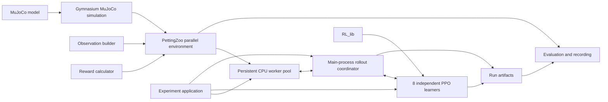

# Development plan

## Purpose

This roadmap divides the Centipede project into small, testable stages. The
first objective is a complete but simple reinforcement-learning experiment. New
complexity is added only after the preceding stage works and has been evaluated.

The academic focus is the emergence of cooperation between independently
trained segment agents. The MuJoCo model is already complete and frozen as the
v1 physical baseline. The simulation and public environment are implemented.

**Current position:** Stages 1 through 6 are complete. The smoke and longer runs
verified training and early local adaptation. Two controlled four-environment
runs then used the same 8,192-transition budget to compare rollout schedules.
Changing from eight 256-step windows to thirty-two 64-step windows sharply
reduced head and first-follower body contact, proving that the current system can
learn posture-related behavior when it receives enough update opportunities.
It did not produce whole-body standing or target-directed walking. Stage 7 now
builds correct synchronous multiprocessing before the experience budget grows.
Reward coefficients and the 256-step production rollout window remain unchanged.
Stages 7 and 8 are complete. Both CPU benchmark reports have been reviewed;
further CPU tuning is deliberately deferred in favor of GPU migration. Stage 9
will proceed through incremental reviews named Stage 1 bis, Stage 2 bis, and so
on, revisiting the existing layers before implementing their GPU replacements.
The current focus is Stage 1 bis: the physical interface and simulation boundary.
Substantial posture training remains Stage 10. Physics is a suspected runtime
bottleneck, pending measurements that separate it from inference and updates.

## Design principles

- Keep the first experiment narrow enough to debug and explain.
- Give every component one clear responsibility.
- Keep all eight learners independent: no shared networks, samples, gradients,
  losses, normalization state, or centralized critic.
- Reuse Gymnasium's `MujocoEnv` for simulation lifecycle and rendering, and use
  PettingZoo's parallel API for simultaneous multi-agent interaction.
- Reuse algorithms, policies, models, and data structures from `RL_lib`; keep
  experiment composition inside Centipede.
- Validate mechanics and data flow before attempting learning.
- Change one experimental factor at a time and retain the earlier version as a
  comparison.
- Evaluate task performance and biological gait resemblance separately.
- Treat proposals in this document as adjustable until their stage begins and
  the user accepts them.

## Component boundaries



This diagram describes the implemented CPU baseline. Stage 9 revisits its
execution mechanisms layer by layer; it does not require a GPU implementation
to inherit the CPU framework classes or process topology. The boundaries are
conceptual and do not require one class or file for every box if a smaller
implementation remains clear.

| Component | Responsibility | Must not own |
| --- | --- | --- |
| MuJoCo model | Frozen body, joints, actuators, contacts, and physical parameters | Learning or reward logic |
| Gymnasium simulation | Extend `MujocoEnv` to load the XML, resolve named indices, assemble controls, advance physics, reset physical state, collect agreed raw contact/state data, and render | Targets, task episodes, partial observations, rewards, or PPO |
| Observation builder | Convert trusted physical and task state into one raw partial observation per segment | Physics stepping, observation normalization, or policy updates |
| Reward calculator | Evaluate the agreed equations from a trusted transition and task events | Contact detection, episode decisions, or network state |
| PettingZoo environment | Wrap the Gymnasium simulation; own target state, the episode clock, arrival/failure decisions, per-agent spaces, action routing, observations, rewards, flags, and task-event information | Configuration-file parsing, PPO internals, or experiment output |
| CPU worker pool | Keep environment replicas alive in child processes, apply commands, and return ordered transition results | Learners, PPO updates, rollout buffers, reward rules, or CUDA state |
| Rollout coordinator | Batch policy queries, dispatch actions to workers, route each returned transition into its agent's isolated buffer, and distinguish environment endings from optimization-window cutoffs | Environment rules, process-local MuJoCo state, repeated input validation, PPO equations, or shared optimization data |
| Learners | Maintain and update eight independent PPO instances, normalizers, and algorithm state using `RL_lib` | MuJoCo names, environment lifecycle, or rendering |
| Experiment application | Load one experiment configuration, derive component and learner seeds, construct objects, run train/evaluate commands, and write checkpoint bundles and metrics | Physics, task rules, or PPO mathematics |
| Evaluation and recording | Load frozen learner and normalization state, consume environment task events, aggregate metrics, and collect rendered frames | Training updates or independent copies of success/contact rules |

### Framework composition

Use composition rather than multiple inheritance:

```text
CentipedeParallelEnv (PettingZoo ParallelEnv, public training API)
`-- CentipedeSimulation (Gymnasium MujocoEnv, internal simulator)
    `-- configured MuJoCo XML (v1: models/assembly.xml)
```

`CentipedeSimulation` replaces the previously proposed custom physics adapter.
It should use the services already supplied by `MujocoEnv`: `model`, `data`,
`frame_skip`, `dt`, state/reset support, simulation stepping, render modes, and
resource cleanup. Centipede-specific code is limited to the model path, named
index mappings, the initial state, conversion of the enabled leg action into the
complete MuJoCo control vector, and any raw transition data needed by the public
environment. The seven spine controls remain zero in the first version.

The experiment configuration supplies the model path. `MujocoEnv` loads and
compiles that file once when `CentipedeSimulation` is constructed; subsequent
steps use the resulting `model`, `data`, and cached named mappings. The simulation
derives its controlled segment IDs from the loaded model's actuator ownership
metadata rather than hardcoding eight. The v1 task configuration still validates
that the selected baseline exposes segment IDs `0` through `7`.

Although it subclasses `MujocoEnv` to reuse those services, the simulation is not
a second public single-agent task. It must not invent a reward, target, episode
limit, or task termination merely to behave like the public environment. Its
physics-facing methods receive trusted controls and return physical state; the
PettingZoo wrapper provides the complete task API.

`CentipedeParallelEnv` is the only environment used by the rollout coordinator.
It owns the eight stable agent identifiers and their Gymnasium `Box` spaces. Its
`reset()` and `step()` return the dictionaries required by PettingZoo. It maps
the simultaneous action dictionary into the joint leg action, calls the internal
simulation once, builds partial observations, evaluates shared and local reward
terms, and returns per-agent termination, truncation, and information dictionaries.
It delegates rendering and closing to `CentipedeSimulation`.

This is the same broad composition used by Farama's MaMuJoCo implementation: a
PettingZoo parallel environment contains an underlying Gymnasium MuJoCo
environment. We retain our own thin wrapper because the target observation,
segment blocks, contact flags, disabled spine actions, and local reward terms are
specific to this project. Do not import MaMuJoCo or reproduce its generic graph
factorization system for the first version.

The public environment must not import PPO, and PPO must not depend on MuJoCo
joint or actuator names. Training and evaluation use the same parallel environment
contract, but evaluation never updates a learner.

The boxes above are responsibilities, not a requirement for one class or module
per box. Observation and reward calculations may remain small pure functions in
the environment module until their size justifies extraction. The rollout
coordinator and experiment application may likewise begin in one runner module.

## Validation ownership

Validate data once at the boundary that first accepts it, convert it into a
trusted internal representation, and let downstream components rely on that
contract. Do not scatter equivalent checks across the runner, environment,
simulation, observation builder, and learner. This keeps failures close to their
source and prevents different copies of the same rule from drifting apart.

| Input or invariant | Single owner | When it is checked |
| --- | --- | --- |
| Experiment configuration and parameter relationships | Configuration loader | Once, before constructing the experiment |
| XML actuator names, ownership metadata, attached joints, limits, and counts | `CentipedeSimulation` | Once, during initialization |
| PettingZoo action keys, value shapes, numeric conversion, finiteness, and bounds | `CentipedeParallelEnv.step()` | Once, at the public runtime boundary before state changes |
| Conversion from eight accepted actions to the trusted 48-value leg vector | `CentipedeParallelEnv` | During the accepted step |
| Conversion from the trusted leg vector to the 55-value MuJoCo control vector | `CentipedeSimulation` | Immediately before simulation; cached actuator IDs are reused |
| MuJoCo control-vector shape | Gymnasium `MujocoEnv` | In its existing simulation call |
| Post-step numerical validity | `CentipedeSimulation` | Once after the physical transition |
| Observation layout | Observation builder | Produced from trusted simulation state; verified by tests |
| Reward equations and ownership | Reward calculator | Produced from trusted transition data; verified by tests |
| PPO samples, shapes, and update requirements | `RL_lib` | At its existing public library boundaries |

The rollout coordinator must not duplicate action validation; it submits policy
outputs to the public parallel environment. Observation and reward helpers must
not revalidate the XML or raw action dictionary. If an internal invariant fails,
that is a programming error to fix at its owner rather than an input to repair in
several downstream modules.

The root `tests/` directory owns automated verification. Tests may construct
controlled valid, boundary, and invalid inputs, but test fixtures and diagnostic
helpers are never imported by `src/centipede`. The initial test ownership is:

| Test file | Scope |
| --- | --- |
| `tests/environment/test_simulation.py` | XML contract, cached mapping, reset, control assembly, timing, finite state, and rendering lifecycle where practical |
| `tests/environment/test_environment.py` | PettingZoo API, agent lifetime, action-boundary rejection, simultaneous stepping, termination, and truncation |
| `tests/environment/test_observations.py` | Exact per-agent layouts and coordinate transformations from controlled states |
| `tests/environment/test_rewards.py` | Shared and local terms from controlled transitions and contact events |

PettingZoo's `parallel_api_test` verifies the public environment in this test
layer. The internal simulation receives focused reset, mapping, stepping,
numerical, and rendering tests instead of Gymnasium's full environment checker:
requiring a complete single-agent task interface there would duplicate or invent
the reward and episode semantics owned by the PettingZoo environment.

## State and data ownership

Several values cross component boundaries without transferring ownership:

- The experiment entry point loads the selected configuration once. Constructed
  components receive only the values they need and never reopen or reinterpret
  the configuration file.
- `CentipedeParallelEnv.reset(seed=...)` is the sole episode-reset entry point.
  It derives deterministic child random streams for the physical reset and target
  sampling, then asks `CentipedeSimulation` to reset only the physical state.
  This prevents target sampling order from changing physical initialization.
- `CentipedeSimulation` is the only component that reads MuJoCo contacts and raw
  body/joint arrays. It returns the agreed physical snapshot and control-interval
  contact summary. The public environment owns the meaning of those signals for
  observations, rewards, failure, and task events.
- The public environment owns elapsed episode time, arrival, termination, and
  truncation. The rollout coordinator consumes those results; it does not impose
  a second episode limit. A fixed PPO rollout-window boundary stops collection
  for an update but does not terminate or reset the environment.
- The environment emits raw observations in its declared spaces. Each learner's
  `RL_lib` normalizer owns normalization and its saved state. Evaluation restores
  and uses that state instead of fitting or normalizing inside the environment.
- The environment exposes agreed task events and primitive measurements in
  `info`. Evaluation aggregates them across fixed episodes; it does not inspect
  MuJoCo directly or reimplement arrival, contact, or failure detection.
- Learner state consists of one PPO instance, normalizer, and rollout buffer per
  agent ID. The experiment application may hold these eight records in a simple
  dictionary, while the coordinator only routes values and triggers updates.
  Records are never pooled; no learner-management framework is required.
- Every worker owns complete environment replicas and their MuJoCo state. The
  main process owns all learners, normalizers, trajectory fragments, updates,
  checkpoints, and progress reporting. Workers exchange only trusted actions and
  transition results; they never receive models, optimizers, or CUDA tensors.
- A worker must return the final observation and ending flags before an ended
  environment is reset. This preserves correct termination bootstrapping and
  prevents an initial reset observation from being mistaken for a terminal one.
- Environment seeds remain derived from the root training seed and stable replica
  indices, not process IDs or completion order. Changing the worker count must
  not silently change which tasks the replicas receive.
- Checkpoint bundling and run-directory layout belong to the experiment
  application. `RL_lib` supplies individual algorithm state where available, and
  evaluation only reads a completed bundle. A generic checkpoint subsystem is
  unnecessary for the first version.

## Stage 1: freeze the first interface

Before implementing the environment, define exact contracts for:

- Action ordering, range, and ownership.
- Observation ordering, dimensions, units, and coordinate frames.
- Shared and local reward terms.
- Contact-event aggregation over one control interval.
- Initial pose and reset randomization.
- Arrival, termination, truncation, and numerical-failure behavior.
- Physics steps per action and the resulting control frequency.

Record these decisions in `control.md` and `environment.md`. A contract is ready
when an implementation can be written without guessing an index, reference
frame, unit, or episode rule.

### Stage 1 completion gate

- Every action and observation element has an exact definition.
- Head, rear, and interior observation dimensions are known.
- Reward equations and event ownership are explicit.
- Reset and episode boundaries are deterministic for a fixed seed.
- Proposed constants are clearly marked and accepted before use.

### Stage 1 recorded baseline

- Segment identifiers are the integers `0` through `7`, from head to rear.
- Every action is `Box(-1, 1, (6,), float32)` in left sweep, left lift, left
  knee, right sweep, right lift, right knee order.
- Action dictionaries must contain exactly all active agents. Shape, numeric
  conversion, finiteness, and bounds are checked before simulation; invalid
  actions raise instead of being silently clipped.
- Actuator IDs are resolved by canonical MuJoCo names and cross-checked against
  `actuator_user` ownership metadata, expected joints, ranges, and total counts.
  XML element order is never used as the policy mapping.
- The frozen `0.1 ms` physics timestep uses `frame_skip=200`, producing one
  20 ms parallel transition and a 50 Hz agent control frequency.
- Every segment has a 27-value state block. The head, interior, and rear
  observation shapes are `(56,)`, `(81,)`, and `(54,)` respectively; only the
  head receives target displacement.
- Physical reset randomizes only the 48 leg angles and velocities. The target is
  independently sampled 10-20 mm away within 15 degrees of the initial heading.
- Arrival occurs when the planar `head_tip` distance is at most 1 mm. It
  terminates all agents; the configured episode limit truncates all agents
  (1,000 steps in the first smoke profile).
- Rewards contain one shared arrival term and local efficiency, body-contact,
  and leg-contact costs. Each follower reduces its distance to the planar point
  occupied by its predecessor at the start of the current transition.
- Complete definitions, ordering, defaults, and first-step behavior live in
  `control.md` and `environment.md`; this roadmap does not duplicate them.

## Stage 2: simulation and environment without learning

Implement `CentipedeSimulation` as a small Gymnasium `MujocoEnv` subclass, then
compose it inside `CentipedeParallelEnv`, the public PettingZoo `ParallelEnv`.
This reuses Gymnasium's XML loading, frame skipping, state management, and
rendering while representing eight simultaneous agents without forcing their
rewards into a single scalar.

The minimum environment must:

1. Let `CentipedeSimulation` load its configured XML once, reset the body,
   assemble the complete control vector, advance one control interval, and
   support Gymnasium rendering and cleanup. The v1 configuration selects
   `models/assembly.xml`.
2. Let `CentipedeParallelEnv` define the eight agents and their spaces, accept one
   six-value action from each agent, map those actions simultaneously, and return
   eight observations, rewards, termination flags, truncation flags, and info
   dictionaries.
3. Keep all spine-yaw commands at zero in the first version.
4. Keep target, partial-observation, and per-agent reward logic outside the
   Gymnasium simulation class.

Use zero, fixed, and seeded-random actions. Do not integrate PPO during this
stage.

### Stage 2 completion gate

- The model runs without invalid state or solver warnings in short checks.
- Reset produces the same state for the same seed.
- Each action controls only the intended segment legs.
- Spine motors remain at zero.
- Observations and rewards contain finite values with the expected shapes.
- Focused simulation tests pass, and PettingZoo's parallel API test passes for
  the public environment contract.

## Stage 3: validate observations and rewards

Test behavior at the public environment boundary rather than duplicating
MuJoCo's own implementation details. The checks should establish that:

- Head and rear agents receive self plus their one existing neighbor.
- Interior agents receive complete self, ahead, and behind segment blocks.
- Neighbor order is consistent throughout the chain.
- Contact flags identify the correct segment owners.
- Only the head observes the target.
- Head distance-ratio and local path-following costs have the correct scale and
  direction.
- Arrival reward is copied to all eight learners.
- Local penalties affect only the participating agents.
- Local observations behave correctly under changes in world position and yaw.
- Reset, arrival, and timeout have distinct meanings; an invalid numerical state
  raises an exception instead of masquerading as an episode ending.

### Stage 3 completion gate

All interface checks pass for the head, one interior segment, and the rear
segment, including deliberately induced contact and episode events.

The completed checks cover exact observation blocks and target-frame behavior,
head and follower reward scales, contact ownership and local costs, shared
arrival, timeout, and numerical failures that raise rather than becoming ordinary
episode endings. Short nonzero action checks remain finite. These checks verify
the implemented component contracts; they do not establish learned walking or a
wave-like gait.

## Stage 4: integrate independent PPO learners

Create eight separate PPO instances from `RL_lib`. Every segment must have its
own actor, critic, optimizers, observation normalizer, rollout samples,
advantages, targets, losses, and checkpoint state.

The rollout coordinator collects one synchronized fixed-length window while the
policies remain frozen. It then gives each learner only that segment's samples.
At a nonterminal window boundary, each learner bootstraps from its own critic;
at a true terminal boundary, its final bootstrap value is zero. Updates may
occur at the same time without sharing training data.

The accepted first integration configuration is recorded in
[control.md](control.md). Source responsibilities are split between learner
construction, rollout coordination, and synchronized learner checkpoints under
`src/centipede/training/`. These components are implemented and covered by
focused tests. The rollout implementation reuses
`RL_lib.data.EpisodeStep` and `rollout_arrays`; its project wrapper retains only
the frozen PPO measurements that the generic rollout type does not contain.

### Stage 4 completion gate

- A short rollout and PPO update complete for every segment.
- Object and storage checks show no accidental parameter, optimizer, normalizer,
  or buffer sharing.
- Rollout truncation uses critic bootstrapping, while true termination does not.
- Saving and restoring all eight learner states reproduces their outputs.

These checks passed in the Stage 4 tests, including one short MuJoCo rollout
followed by real PPO updates for all eight learners. This verifies the integration
path, not learned walking or training stability over a long run.

## Stage 5: single-environment training smoke test

**Goal:** Verify that one complete training run executes correctly. A working
runner and finite PPO updates, rather than policy improvement, pass this stage.

The initial task should remove unnecessary sources of variation:

- Flat ground and the standard initial pose.
- A close target directly ahead or within a narrow forward region.
- Six leg actions per segment and no spine actions or spine observations.
- Immediate-neighbor observation radius fixed at one.
- Episode completion on arrival or time limit, with numerical failure handled
  separately.
- No continuing target sequence, terrain variation, or morphology variation.

Use the recorded Stage 1 reward without adding training-specific shaping. The
head receives its target-distance ratio cost, each follower receives its local
path-following ratio cost, arrival is shared, and contact costs remain local.
This gives a dense learning signal without exposing target information to
followers or prescribing a leg sequence. Complete formulas and initial
coefficients live in [environment.md](environment.md).

The first smoke configuration selects one environment, four rollout windows of
256 steps each, one recorded training seed, and two fixed evaluation seeds. It
uses the Stage 4 learner and PPO defaults. Its purpose is to verify the complete
single-environment training path, not to establish improved behavior or learned
walking. A longer training budget can be chosen after the first evaluation.

### Stage 5 completion gate

- The configured smoke run completes all four windows and 1,024 environment
  transitions without a non-finite update.
- All eight independent learners are present in each synchronized checkpoint;
  their parameters are finite and change during the run.
- No claim of improved navigation, cooperation, or walking is made from the
  training run alone.

This gate passed for the single-environment smoke run. Multiple replicas and a
larger training study have not been tested by it.

## Stage 6: early learning evaluation

**Goal:** Determine whether training changes behavior in a useful direction at
all. Locomotion is not required yet.

Evaluate frozen checkpoints to determine whether training produces even a
modest improvement. Reaching the target often or showing a natural gait is not
required at this stage. The four-window smoke run showed reduced rear-segment
contact but almost no head movement. A second profile therefore allows a longer
episode while keeping the model, reward, seed, learner settings, and PPO window
unchanged. It uses eight windows of 256 transitions and a 2,048-step limit. An
arrival may still end the episode early. Compare contact frequency and movement
as well as return, because longer episodes accumulate more reward terms.

The comparison uses:

- Synchronized checkpoints restore all eight learners and their normalization
  states for evaluation.
- Frozen-policy evaluation that does not update networks or normalizers.
- One stable diagnostic result per checkpoint, containing per-episode records
  and a summary. Evaluation replicas may later divide the episode seeds among
  themselves without changing that result format or the meaning of its metrics.
- The same held-out episodes for intermediate and final checkpoints, plus
  zero-action and random-action baselines. Checkpoint policies use deterministic
  action selection; the random baseline uses a seeded stream per episode.
- Undiscounted cumulative episode return for the head and followers separately,
  with success, initial and final target distance, and head path length as
  diagnostics. Retain time to target, body and leg contacts, and action
  magnitude to interpret the behavior.
- A human-readable run report (HTML or equivalent) alongside binary checkpoints,
  presenting the configuration and evaluation metrics.

The first two evaluation seeds showed reduced rear contact. Two additional
held-out seeds confirmed it. Four seeds and one training run support an early
learning signal, not a strong claim about locomotion or robustness. Reward alone
is not evidence of walking or cooperation.

The result contracts, episode diagnostics, aggregation, seeded baselines,
checkpoint evaluation, run orchestration, static HTML renderer, and command
entry exist under `src/centipede/experiment/` and `tools/`. The longer run's
reports are `runs/stage6_long_episode/evaluation.html` and
`evaluation_confirmation.html` in that same directory. These generated files
remain local and outside version control.

### Stage 6 completion gate

**Passed.** Frozen evaluations on four held-out seeds repeatedly showed segment
7 avoiding body-ground and leg-leg contact, while segment 6 sharply reduced
body-ground contact from checkpoint 2 to checkpoint 6 relative to zero actions.
The final checkpoint partially regressed for segment 6, and most other segments
did not improve consistently. All learned episodes reached the time limit, with
little head movement. The result establishes early local adaptation only.

## Stage 7: synchronous multiprocess collection

**Goal:** Replace direct sequential environment stepping with a correct,
persistent CPU worker pool while preserving the behavior already established in
Stages 1–6. This stage proves equivalence and lifecycle safety; it does not need
to improve throughput or learning.

### Execution boundary

Introduce one small environment-pool interface between the rollout coordinator
and the public PettingZoo environments. It needs only four operations: reset all
replicas with ordered seeds, step all replicas with ordered action dictionaries,
reset selected replicas after episode endings, and close all owned resources.
Provide two implementations:

- A serial pool containing the current in-process behavior. It is the correctness
  reference for Stage 7 and the one-process benchmark for Stage 8.
- A process pool using Windows' `spawn` context and persistent workers. Each
  worker owns one or more complete `CentipedeParallelEnv` instances, including
  their MuJoCo models, data, targets, episode clocks, and random generators.

The machine has four physical cores and eight logical processors. Worker count
and environment count are separate settings. A 32-replica run may assign eight
environments to each of four workers, but those eight replicas are stepped in a
stable sequence inside that worker. Two- and four-worker layouts are sufficient
for Stage 7 correctness checks; their speed is decided only in Stage 8.

### State ownership and collection order

The main process continues to own all eight segment learners, normalizers,
policy sampling, trajectory fragments, GAE, PPO updates, checkpoints, and
progress output. Workers own physics and task environments only. They must not
receive models, optimizers, normalizers, rollout buffers, or CUDA state.

For each control transition, the coordinator performs four ordered phases:

1. Normalize observations and sample every replica's actions in global replica
   order using the unchanged segment learners.
2. Send every worker its assigned action dictionaries before waiting for results.
3. Gather results from all workers and restore global replica order regardless
   of worker completion order.
4. Append rewards and policy measurements to the existing per-replica,
   per-agent fragments.

RL_lib currently normalizes and samples one observation at a time. Stage 7 keeps
that supported API and groups the resulting actions for dispatch; it does not add
a tensorized policy interface before profiling shows a need for one.

Collection remains synchronous and on-policy. Every replica completes transition
`t` before any replica begins transition `t + 1`, and PPO updates begin only after
all replicas contribute the configured window. A worker returns the terminal
observation without resetting. The coordinator first finalizes the corresponding
fragment, using zero bootstrap for true termination and critic bootstrap for
truncation, and then requests that replica's reset. A rollout-window cutoff still
bootstraps without resetting the physical episode.

### Configuration and process lifecycle

Add `worker_count` beside `environment_count` at the external training-config
boundary and preserve it in the resolved run snapshot. Existing snapshot formats
must remain readable. Construct one temporary reference environment in the main
process to derive model-owned agent IDs and spaces for the unchanged learner
builder, then close it before starting workers.

Keep worker communication simple: persistent process connections carrying the
current compact NumPy actions and PettingZoo results are adequate. Use a stable
replica-to-worker assignment and preserve replica seeds across serial and process
runs. Do not introduce shared memory, automatic retries, dynamic scheduling, or
another environment API in this stage.

The Windows launcher must avoid eagerly importing learner and Torch modules when
spawned children import the main script. Worker failures, partial startup,
keyboard interruption, and normal completion must all close environments, join
workers, terminate stragglers when necessary, and surface one useful main-process
error without leaving orphan processes.

### Stage 7 implementation surface

- Add the serial and spawned process pools in one focused training module.
- Adapt `RolloutCoordinator` to the pool interface and the four-phase collection
  order while retaining its fragment, GAE, and PPO-update logic.
- Adapt the runner to construct a reference environment, learners, and the pool.
- Extend reusable training presets and resolved snapshots with `worker_count`.
- Make the terminal launcher safe for Windows process spawning.
- Add focused pool, rollout-boundary, runner-cleanup, and parity tests.

### Stage 7 completion gate

**Passed.** Fixed-seed serial/process parity, repeated two- and four-worker
windows, one-step episode truncation/reset boundaries, exact per-agent sample
counts, worker error propagation, cleanup, and the Windows spawn import boundary
are covered by automated tests. A manual launcher smoke run then completed one
256-step window with two environments on two workers, saved all eight learners,
and recorded 512 finite transitions in `checkpoint_1.pt`. These checks establish
collector correctness and lifecycle safety only; they make no throughput or
learning claim.

- Fixed seeds and fixed actions yield equivalent ordered observations, rewards,
  endings, and diagnostics through the serial and process pools within the
  established numerical tolerance.
- Terminal observations are finalized before reset, no fragment crosses an
  episode boundary, and optimization cutoffs continue live episodes correctly.
- Every learner receives exactly `E × W` samples from its own segment for a full
  window, with no cross-agent samples, parameters, losses, or normalization.
- Two- and four-worker checks complete repeated short windows, propagate startup
  and runtime failures, and shut down without orphan processes.
- The existing focused serial rollout behavior remains covered. Passing this
  gate makes no claim about throughput, standing, or walking.

## Stage 8: establish the CPU performance reference

**Goal:** Establish a measured CPU execution reference for subsequent GPU
migration. The scope was revised after both benchmarks: additional CPU thread
tuning and broad profiling are deferred, and batched inference will be developed
with the GPU learner interface. This stage makes no learning claim.

Benchmarking is orchestration owned by the terminal launcher. It derives normal
training presets and passes every case to the unchanged `run_training` function;
it does not introduce another runner, collector, pool, or benchmark source
module. One reusable TOML owns the matrix. The launcher records each complete
training call's wall time, seconds per window, transition count, and transitions
per second in incremental JSON and Markdown reports.

The first benchmark uses these candidate values:

| Dimension | Values |
| --- | --- |
| Environment replicas | `4`, `8`, `16`, `32` |
| CPU workers | `1`, `2`, `4`, `8` |
| Rollout window length per environment | `64`, `128`, `256`, `512` |
| Episode limit | `256`, `2,048`, `8,192` |

The matrix is progressive rather than a full Cartesian product. First compare
every valid worker count for each environment count at the `256`-step rollout
and `2,048`-step episode baselines. Then reuse each environment count's fastest
worker layout for the remaining rollout sizes. Finally, compare episode limits
only with 32 environments and that group's selected worker count. This covers
the decisions without multiplying all four dimensions together.

The first 29-case benchmark completed without recorded errors. Four workers won
for four environments; eight workers won for 8, 16, and 32 environments. At 32
environments, eight workers completed the baseline 256-step window in 185.27 s,
versus 234.04 s with four workers. Later 32-environment cases reached roughly
50–52 transitions/s. These are single-repetition whole-run measurements, including
startup, collection, updates, checkpoint writing, and shutdown. They neither
identify the dominant phase nor measure sustained learning throughput.

The follow-up reused the same benchmark TOML for six cases: 32 and 64 environments,
each with 6, 8, and 16 workers, a fixed 256-step rollout window, an 8,192-step
episode limit, and two update cycles. All six cases were marked complete.

| Retained reference | Environments | Workers | Rollout steps | Transitions/s |
| --- | ---: | ---: | ---: | ---: |
| Best extended-run candidate | 32 | 16 | 256 | 51.06 |
| Earlier baseline, extended run | 32 | 8 | 256 | 39.74 |
| Larger-batch alternative | 64 | 6 | 256 | 49.85 |
| Small local check, first run | 4 | 4 | 256 | 26.56 |

Sixteen workers reduced elapsed time by about 22% relative to eight workers for
32 environments in the extended run. Sixty-four environments did not improve
throughput over the best 32-environment result. Keep these as measured candidates,
not universal optima: the 32-environment/eight-worker case measured 52.15
transitions/s in the first run at the same episode limit, but 39.74 in the second.
The runs had different update-cycle counts and only one repetition each.

The retained reports are
`runs/benchmarks/20260923T141432Z-c24c2d1c/benchmark_report.md` and
`runs/benchmarks/20260923T153437Z-5bf25598/benchmark_report.md`. Their 35 rows are
marked complete. The summaries here preserve the selection evidence without
copying generated reports into `configs/`. These candidates do not silently
replace the editable training preset or settle the GPU batch size.

Diagnostic profiling has overhead; its timings must be distinguished from normal
benchmark throughput. The approximate 5.6-hour projection for 1,048,576
transitions is provisional. Contact patterns during learning can change physics
cost. Short runs of 256 steps also cannot establish the sustained cost of
2,048- versus 8,192-step episodes, since neither limit is reached. Do not claim
that episode horizon has been fully benchmarked.

### Stage 8 completion gate

**Passed under the revised scope.** Both reports were reviewed and the useful
CPU configurations and limitations are recorded above. CPU-specific optimization
is explicitly deferred to avoid work that may be displaced by the GPU execution
path. No phase-level bottleneck, sustained-run speedup, or learning improvement
has been demonstrated by these benchmarks. The pending configuration renaming
remains tracked below rather than being reported as completed.

## Stage 9: GPU physics and learning on Kaggle

**Goal:** Run the centipede's parallel physics, policy inference, and PPO learning
on a Kaggle GPU, with validated task behavior and measured end-to-end throughput.
Full GPU execution is the intended training architecture. The CPU implementation
remains a reference for correctness and local debugging.

### Incremental review: Stage 1 bis onward

Revisit the original development sequence inside Stage 9. Review one layer,
explain its current responsibility, agree on what to retain or replace, then
implement and check that bounded change before moving upward. The sequence below
is a navigation outline, not a completed audit of the later layers.

| Review step | Scope |
| --- | --- |
| Stage 1 bis | Physical contract and simulation boundary; identify the first GPU feasibility check. |
| Stage 2 bis | Simulation and task environment composition, including device-resident state and resets. |
| Stage 3 bis | Observation, reward, contact, and episode behavior checks against the CPU reference. |
| Stage 4 bis | Independent RL_lib learners, batched rollouts, device support, and checkpoints. |
| Stage 5 bis | Kaggle setup and a short integrated training smoke run. |
| Stage 6 bis | Frozen evaluation and diagnostic continuity across backends. |
| Stage 7 bis | Batched GPU execution and lifecycle review; reuse CPU multiprocessing only where useful. |
| Stage 8 bis | End-to-end GPU measurements and selection of the substantial training budget. |

Reuse accepted contracts, calculations, mappings, and tests when that remains
simple. Replace an implementation when preserving it would require more adapters
or branching than a direct solution. Do not create universal backend abstractions
or move files merely to anticipate future needs. Retain the working CPU reference
until its replacement is verified; archive superseded code only after checking
that it is no longer needed for execution or validation.

#### Stage 1 bis: current focus

Inspect only `environment/simulation.py`, its physical contract, and the relevant
model/interface checks initially. This layer owns XML loading and named mappings,
physical reset, control assembly, stepping, and physical state/contact extraction.
Targets, rewards, policy observations, episode clocks, and learning remain above
it. Rendering is an optional service and must not determine GPU training layout.

The present ownership boundary is suitable. Its implementation is CPU-specific:
`MujocoEnv`, mutable MuJoCo data, NumPy copies, and Python contact/segment loops.
The Gymnasium transition returned by this internal simulator has neutral rewards
and endings because the task is defined above it. A GPU backend need not reproduce
that placeholder transition merely to fit the current superclass.

Preserve the meaning of `PhysicalSnapshot` fields, units, frames, segment/action
order, final-state contact flags, 20 ms control interval, and leg-only reset noise.
Decide the batched representation, precision, buffer ownership/lifetime, and
selective-reset interface after checking backend requirements. Do not force a
copied NumPy snapshot per replica on the device path. Initialization-time XML
mapping checks may remain on CPU without requiring physics steps to return there.

**Completion condition:** document the physical input/output contract and a
keep/adapt/replace decision for this layer, then agree on the smallest Kaggle
physics feasibility check. No task-layer refactor or learner implementation is
part of this first review.

#### Pending terminology cleanup

The agreed names are `rollout_window_steps` (formerly `steps_per_environment`)
and `update_cycles` (formerly `rollout_windows`); `max_episode_steps` remains the
episode horizon. This migration is authorized but not implemented. Complete it
as a separately bounded cleanup before the new integrated training runs, preserving
readability of old saved configurations and checkpoints. Do not confuse the
provisional 128 update cycles with rollout length or an approved training budget.

### Implementation direction

Evaluate MuJoCo Warp first because it targets NVIDIA GPUs and interoperates with
PyTorch; MJX is another candidate if compatibility or performance warrants it.
Select the backend after checking the frozen XML, articulated-body features,
contacts, numerical precision, and available Kaggle GPU memory. A large connected
centipede may present different scaling characteristics from small independent
bodies. Parallel environments make GPU batching relevant, but do not establish
either compatibility or a particular speedup by themselves.

Extend RL_lib with the generic capabilities required for device-aware models,
policy sampling, PPO batches and updates, normalization, random generators, and
checkpoint restoration. Centipede continues to own the task, replica routing,
experiment runner, and reporting. Do not copy algorithms or import RL_lib's
experiment runners. Support batched replicas for each segment without sharing
networks, losses, normalizers, or samples across segment IDs.

Keep frequently used simulation, observation, reward, action, and training arrays
on the GPU where practical. Copy small diagnostics and saved artifacts to the host
when needed. Moving only neural networks to the GPU is an intermediate validation
step; it does not meet the full migration goal. Adapt the CPU Gymnasium/PettingZoo
implementation's contracts to a batched device representation without forcing
every transition through Python dictionaries and NumPy round trips.

This is a backend and library integration task, not an assumed quick configuration
change. Reuse the accepted model and task definitions. Any required physical
approximation or model revision needs a documented comparison and explicit user
agreement. Do not silently alter contacts, rewards, observations, or control timing
to obtain a faster backend.

### Kaggle execution and persistence

Use a small setup notebook to obtain Centipede and RL_lib, install compatible
dependencies, and invoke the project's Python entry point with a reusable preset.
Keep project implementation in its existing packages. Configure writable output
paths and record package versions, GPU identity, memory, and session constraints
on the actual Kaggle runtime rather than assuming a fixed hardware allocation.

Verify checkpoint export and continuation across sessions. Restore all learners,
optimizers, normalizers, random states, and update counters. Document whether
continuation starts fresh physical episodes; learner checkpoints currently omit
live simulation state and should not be described as exact trajectory resumes.
The user launches cloud training and evaluation, as with local experiments.

### Stage 9 completion gate

- A Kaggle setup can install both projects and execute the selected GPU backend.
- Controlled CPU/GPU comparisons validate joint/control mapping, observations,
  contacts, rewards, resets, terminations, truncations, and bootstrap boundaries.
  Compare physical tolerances and task behavior; do not require bitwise equality
  between backends with different numerical implementations.
- Repeated collection/update cycles use GPU physics and GPU learner computation,
  preserve eight independent learners, and produce finite updates and loadable
  checkpoints. Session continuation and frozen evaluation are tested.
- Report compilation/startup separately from sustained throughput, memory usage,
  and CPU/device transfer costs. Measure gains on comparable workloads and choose
  a feasible training budget from those results. If the backend does not provide
  a useful gain, diagnose or revise the migration before claiming completion.


## Stage 10: supported whole-body posture

**Goal:** Use the selected execution profile and a materially larger experience
budget to learn supported posture across the complete centipede. Standing is a
distinct milestone and does not count as walking.

The earlier controlled comparison showed that 64-step windows created more
posture-related improvement than 256-step windows within the same small total
budget. This demonstrated sensitivity to update opportunity, not that 64 is the
final window. Stage 10 returns to `W = 256` and increases total experience so the
learner receives many stable updates rather than forcing more updates from the
same 8,192 transitions.

Use the GPU execution profile validated in Stage 9. Replica count and total
update cycles remain decisions to make from that stage's throughput and memory
measurements. CPU worker counts do not determine GPU batch size. The earlier CPU
budget below remains an illustrative reference, not an approved GPU run:

| Symbol | Proposed value | Meaning |
| --- | ---: | --- |
| `E` | 32 | Independent environment replicas. |
| `W` | 256 | `rollout_window_steps`: transitions per replica before an update cycle. |
| `H` | 8,192 | Episode limit, equal to 163.84 simulated seconds. |
| `U` | 128 | `update_cycles`: number of complete collect-and-update cycles; provisional. |

This example yields 8,192 transitions per update and 1,048,576 total transitions.
The episode limit is independent of rollout length: episodes continue across
update cycles and reset on arrival or truncation. Episode count is therefore an
outcome rather than the fixed training budget. Agree on the actual replica count
and update-cycle budget after Stage 9 measurements. Keep the v1 model, close
forward target, reward, inactive spine
commands, observation radius, and 64-by-64 learner architecture fixed for the
first scaled posture run.

Evaluate every saved checkpoint on fixed held-out seeds with zero and random
baselines. Add body clearance and plausible foot-support diagnostics, plus a few
frozen-policy recordings, so reduced contact cannot be mistaken for hanging,
rolling, sliding, or unstable flailing. A promising result must be repeated with
another training seed before being described as robust.

### Stage 10 completion gate

The head, representative middle segments, and rear maintain body clearance with
plausible foot support across held-out episodes and recordings. Improvement at
only one end does not pass. Target progress is recorded but is not required. If
the gate fails, diagnose the measurements and change only one reward, network,
or training factor in the next controlled run.

## Stage 11: sustained walking toward the close target

**Goal:** Convert the Stage 10 supported posture into sustained connected-body
locomotion toward the existing nearby forward target.

Keep the accepted Stage 10 setup as the baseline. Decide explicitly whether each
experiment starts from scratch or resumes a posture checkpoint; do not mix those
conditions in one comparison. A valid continuation must restore learner models,
optimizers, normalizers, random state, and training position rather than merely
loading evaluation weights.

Initially keep the target distribution and reward unchanged. Compare checkpoints
on common held-out seeds using segment displacement, head path length, net target
progress, arrivals, time to target, contact rates, and recordings. Distinguish
coordinated walking from falling, sliding, rolling, or throwing only the head.
If posture remains stationary, test one diagnosed curriculum or one other
isolated change; do not silently prescribe a gait or add several reward terms.

### Stage 11 completion gate

Several connected segments produce repeatable sustained locomotion, and the head
makes meaningful progress toward close forward targets. Reliable arrival,
turning, and a biological wave are not yet required. Contact reduction or
isolated head motion alone does not pass.

## Stage 12: navigation curriculum

**Goal:** Extend established locomotion to targets that require turning and
longer travel without destroying the walking baseline.

Change target difficulty one factor at a time:

1. Widen the current forward bearing beyond ±15 degrees.
2. Permit targets anywhere around the body, including behind the head.
3. Increase distance beyond the current 10–20 mm range.
4. Spawn a new target after arrival without resetting the simulation.
5. Broaden initial-pose randomness only if robustness requires it.

Each curriculum step retains its predecessor as a fixed-seed comparison. Agree
on success thresholds before the corresponding experiment, and do not advance
until the failure modes of the current step are understood.

### Stage 12 completion gate

The centipede approaches targets across the agreed wider bearing and distance
ranges, turns toward targets behind the head, and can pursue a replacement target
after arrival. Report these abilities separately rather than hiding them inside
one aggregate score.

## Stage 13: control and information variants

**Goal:** Determine whether more body control or local information improves an
already functional walking and navigation system.

Evaluate separate controlled variants for:

1. Active spine-yaw actions with corresponding observations.
2. Commanded, passive, and fixed spine behavior.
3. Neighbor observation radii greater than one.
4. A short observation history or recurrent policy only if partial observability
   is demonstrated as a limitation.

Do not overwrite the frozen v1 model or first-version environment contract.
Every variant receives its own configuration, measurements, and comparison with
the simpler accepted baseline.

### Stage 13 completion gate

Every adopted variant answers its stated question through a controlled result.
Retain only changes with a demonstrated benefit or useful scientific finding;
additional complexity is not assumed to be better.

## Stage 14: wave-like locomotion

**Goal:** Measure whether a propagating leg wave emerges from cooperative
navigation and test an explicit gait objective only if the natural result is
insufficient.

First evaluate the navigation policy without adding a gait reward. Measure:

- Phase differences between neighboring legs.
- Direction, speed, and consistency of phase propagation along the body.
- Step frequency, duty factor, and left-right coordination.
- Locomotion speed, stability, arrivals, and contact rates.
- Action magnitude or estimated effort per unit distance.

Use quantitative traces together with recordings. Visual resemblance alone is
not evidence of a propagating wave. If the navigation-only policy lacks a clear
wave, introduce one isolated gait objective and compare it with the unchanged
navigation baseline. This preserves the distinction between emergent cooperation
and motion directly imposed by reward design.

### Stage 14 completion gate

Report the measured phase pattern and whether it propagates consistently along
the body. If an explicit gait objective is tested, report its controlled effect
on gait, navigation, stability, and effort relative to the navigation-only
baseline.

## First-version contract

The following choices summarize the recorded Stage 1 baseline. Exact definitions
remain in the owning design documents.

| Decision | First version |
| --- | --- |
| Environment API | PettingZoo `ParallelEnv` backed by Gymnasium `MujocoEnv` |
| Learners | Eight independent PPO instances |
| Actions | Six normalized leg controls per segment |
| Spine | Commands fixed at zero; absent from observations |
| Neighborhood | Existing immediate neighbors only |
| Neighbor data | Complete segment state and flags for every visible segment |
| Target data | Head-local forward and lateral displacement, head only |
| Target placement | Close and initially forward |
| Episode boundary | Arrival termination or time-limit truncation; numerical invalidity is an exception |
| Training batches | Fixed rollout windows with correct bootstrapping |
| Evaluation | Separate frozen-policy episodes |
| Complexity changes | One controlled change per experiment |

## Maintaining this plan

Update the current-position statement and completion gates as decisions are made
and stages are verified. Do not mark a stage complete because code exists; record
the checks that demonstrate its completion. Detailed model, control, and task
decisions remain in their owning documents rather than being duplicated here.

## Framework references

- [Gymnasium `Env` API](https://gymnasium.farama.org/api/env/)
- [Gymnasium MuJoCo environments](https://gymnasium.farama.org/environments/mujoco/)
- [PettingZoo parallel API](https://pettingzoo.farama.org/api/parallel/)
- [Gymnasium `AsyncVectorEnv`](https://gymnasium.farama.org/main/api/vector/async_vector_env/),
  used as a multiprocessing design reference rather than a direct multi-agent
  wrapper
- [Python multiprocessing contexts](https://docs.python.org/3/library/multiprocessing.html#contexts-and-start-methods)
- [PyTorch multiprocessing guidance](https://docs.pytorch.org/docs/stable/notes/multiprocessing.html)
- [MuJoCo Warp](https://mujoco.readthedocs.io/en/latest/mjwarp/index.html),
  the first GPU-physics candidate to evaluate in Stage 9
- [MuJoCo MJX](https://mujoco.readthedocs.io/en/latest/mjx.html), an alternative
  GPU-physics candidate
- [Kaggle notebooks](https://www.kaggle.com/docs/notebooks), the intended cloud
  execution environment for Stage 9
- [Gymnasium-Robotics MaMuJoCo](https://robotics.farama.org/envs/MaMuJoCo/),
  retained as a reference rather than an initial dependency
- [MaMuJoCo composition source](https://github.com/Farama-Foundation/Gymnasium-Robotics/blob/main/gymnasium_robotics/envs/multiagent_mujoco/mujoco_multi.py)
