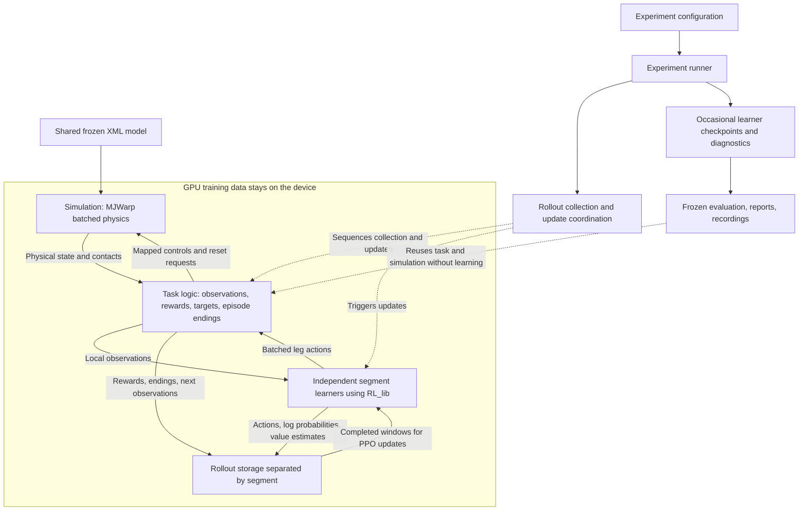

# GPU development plan

## Purpose and current position

This plan builds the GPU version of Centipede incrementally, preserving the
centipede task while replacing the CPU execution machinery. Physics, policy
inference, and PPO learning run on a GPU, with Kaggle as the intended training
environment. Full GPU execution is the intended training architecture; the
[CPU implementation](../cpu/plan.md) remains the reference for correctness and
local debugging. The scientific goals remain cooperative walking, navigation,
and eventually a measurable wave-like gait.

The MuJoCo model is frozen as the v1 physical baseline described in
[model.md](../docs/model.md), and the shared task contract lives in
[control.md](../docs/control.md) and [environment.md](../docs/environment.md).
Stage numbers restart at 1. CPU completion does not automatically complete a GPU
stage.

**Current position: Stage 1, in progress.** XML loading, named mappings, GPU
allocation, batched leg-control stepping with overflow and finiteness checks,
and selective resets are implemented. Seven setup, control, reset, and
invalid-physics tests pass on the local MX330, but the real stepping test fails
to compile MJWarp's collision kernel because its parameters exceed this GPU's
limit; see [the verification record](README.md#setup-verification).
Physical-state extraction is the next implementation step, followed by
`gpu/pyproject.toml` and a minimal Kaggle test run for motion verification on a
compatible GPU.

### Configuration names

The GPU configuration keeps four settings distinct: world count,
`rollout_window_steps` (transitions per world before an update cycle),
`max_episode_steps` (the episode limit), and `update_cycles` (the number of
collect-and-update cycles). The CPU configuration uses the same names.

### Local development and validation

Use the MX330 for supported allocation, mapping, device operations, and focused
component tests. Continue implementing without waiting for different hardware.
Keep the full physics test available and its known local failure documented; a
selected passing subset does not mean the entire suite passes. Use
`-m "not physics"` for the supported local subset; the default suite includes
motion validation. Check custom kernels against the official MJWarp analyzer as
well as compiling and exercising them on-device; see the
[kernel review](README.md#kernel-review).

Motion, contact behavior, stability, and integration checks that cannot run
locally remain unverified until run on Kaggle. Do not alter the frozen model or
disable collisions to bypass this limitation. Complete those checks before
substantial training, rather than treating assumed correctness as a result.
Stage 1 therefore includes a minimal Kaggle test run, separate from Stage 7's
training setup and scaling work.

## Principles

- Preserve the accepted task. Any physical approximation or model revision needs
  a documented comparison and explicit agreement; do not silently alter
  contacts, rewards, observations, or control timing to obtain a faster backend.
- Keep all eight learners independent: no shared networks, samples, gradients,
  losses, normalization state, or centralized critic.
- Keep physics, observations, actions, rewards, and learning arrays on the GPU
  where practical. Copy only small diagnostics and saved artifacts to the host.
  Moving only neural networks to the GPU is an intermediate step, not the goal.
- Reuse `RL_lib` and extend it with generic device support rather than copying
  algorithms into this project.
- Reuse accepted CPU contracts, calculations, mappings, and tests when that
  remains simple; replace an implementation when preserving it would require
  more adapters or branching than a direct solution. Do not import the CPU
  package or create a universal backend abstraction.
- Validate mechanics and data flow before attempting learning, comparing with
  the CPU reference within justified tolerances rather than bitwise.
- Change one experimental factor at a time and retain the earlier version as a
  comparison.
- Evaluate task performance and biological gait resemblance separately.
- Treat proposals in this plan as adjustable until their stage begins and the
  user accepts them.

## Architecture

### Components

The boxes are responsibilities, not a requirement to create a class or file for
every box. Keep ordinary functions where they are sufficient. Python may
coordinate operations on the CPU; the intent is to keep training data on the
GPU without copying every world's state back to the CPU at every transition.

| Component | Owns | Does not own |
| --- | --- | --- |
| Simulation | XML mappings, physical state, control placement, integration, physical resets, contact interpretation | Targets, rewards, PPO, episode time limits |
| Task logic | Local observations, reward calculations, targets, episode counters and reset decisions | Physics solver or network updates |
| Training coordination | Independent learners, collection windows, bootstrap boundaries and update scheduling | Physics details or reward formulas |
| RL_lib source | Generic algorithms, models, policies, normalization and rollout data utilities | Centipede-specific task and experiment logic |
| Experiment runner and tools | Configuration, launch commands, progress, saved artifacts and reports | Alternative implementations of physics or PPO |

One learner belongs to each segment position. Its network processes that
segment's observations across all worlds. Different segments never share network
parameters, optimizer state, normalization statistics, samples, or losses.

### Framework composition

MuJoCo Warp (MJWarp) is the physics backend being implemented. It is evaluated
first because it targets NVIDIA GPUs and interoperates with PyTorch; MJX remains
an alternative if compatibility or performance warrants it. The choice is
confirmed only by the Stage 1 motion checks and Stage 7 measurements. A large
connected centipede may scale differently from small independent bodies, and
parallel worlds make GPU batching relevant without establishing either
compatibility or a particular speedup.

`CentipedeSimulation` owns one compiled model and the device state of a batch of
independent worlds. It loads the shared XML with MuJoCo on the host, validates
its named contract once, and copies the model and a batched state to the GPU.
`step()` holds one batch of leg actions for 200 physics steps; `reset()` restores
selected worlds. It is a physical simulation, not a Gymnasium or PettingZoo task
wrapper. Rendering is an optional service and must not determine the training
layout.

Compared with the CPU implementation:

- **No PettingZoo or Gymnasium environment inheritance is required.** MJWarp
  handles batched physics; a small task interface owns our rules.
- **No CPU worker pool or pipes are needed.** A world is an independent
  centipede simulation in a batch, not a separate Python process.
- **No mandatory copied NumPy snapshot per world.** Preserve the meaning of the
  physical fields, but decide their batched device representation before use.
- **The feedback loop remains:** observe, choose actions, advance physics, and
  calculate rewards. MJWarp does not define our partial observations or rewards.
- **Training checkpoints remain occasional saves** of learner state, useful for
  continuation and evaluation. They are not physical snapshots and are not an
  intermediary between the policy and the simulation.

### Validation ownership

Validate external inputs once at their owning boundary, then trust internal
values. Experiment configuration loaded from TOML is the runtime validation
boundary; the simulation, task, and training layers trust the arguments and
arrays passed between them and do not test invalid-argument cases.

| Input or invariant | Single owner | When it is checked |
| --- | --- | --- |
| Experiment configuration, including device and capacities | Configuration loader | Once, before constructing the experiment |
| XML actuator names, ownership metadata, attached joints, control ranges, and contact metadata | `CentipedeSimulation` | Once, during construction |
| MJWarp capacity overflows and non-finite physical state | `CentipedeSimulation` | After every control interval |
| Policy actions | Trusted: tanh-bounded policy outputs, neither checked nor clipped | Not checked |
| PPO samples, shapes, and update requirements | `RL_lib` | At its public library boundaries |

Simulation failures and capacity overflows are reported, not hidden as ordinary
episode endings or silently reset. Solver iteration-limit flags only mark
incomplete convergence and are not errors. GPU-specific type or precision
changes require an explicit contract; existing class and field names remain
where their meaning fits.

The `gpu/tests/` directory owns automated verification. The `physics` marker
identifies tests that integrate the complete frozen model on a compatible GPU.

### State and data ownership

- The experiment entry point loads the selected configuration once. Constructed
  components receive only the values they need.
- The simulation owns the device state of every world. Reset uses a boolean
  device mask, and each world has a persistent device random state for leg
  noise; its seed is combined with the stable world index. Target sampling uses
  a separate random stream.
- Physical fields keep their shared meaning without a copied snapshot per world.
  Previous-step values are preserved where rewards or stored transitions need
  them; live device views must not accidentally overwrite history.
- The task owns episode counters and reset decisions. Only worlds whose episodes
  end are reset, and final observations remain available for bootstrapping before
  reset observations replace them.
- A collection-window cutoff triggers an update but does not reset a physical
  episode.
- Each learner owns its normalization state and rollout samples for its segment
  across all worlds.
- Checkpoints save all segment learners and the state needed for continuation.
  They exclude live physical state; exact live-trajectory restoration is not
  implied.

### RL_lib integration

Audit and reuse `RL_lib/src/rl_lib` in Stage 4 before writing helpers. The
[CPU audit](../cpu/plan.md#rl_lib-integration) found that the package has no
explicit CPU/CUDA device selection. Extend RL_lib with the generic capabilities
required for device-aware models, policy sampling, PPO batches and updates,
normalization, random generators, and checkpoint restoration, after agreeing on
the scope. Centipede continues to own the task, world routing, experiment
runner, and reporting; it does not copy algorithms or import RL_lib's
experiment runners.

## Stages

Each stage has one goal and a scope: the layer and files it creates or changes.
Package paths are relative to `gpu/src/centipede_gpu/`. File names for later
stages are expected locations, not scaffolding to create early.

### Stage 1 — Batched physical simulation

**Goal:** make the program able to create, advance, reset, and read batches of
centipede worlds on the GPU.

**Scope:** the physical layer. `environment/simulation.py` and
`gpu/tests/environment/test_simulation.py`, plus the package metadata and
dependencies in `gpu/pyproject.toml` so the same installation works locally and
on Kaggle. It replaces the current `gpu/pytest.ini` path setting.

Finish the simulation using MJWarp APIs for integration, forward computation,
and selective reset. Preserve the named action mapping, zero spine motor
commands, and leg-only reset noise. Zero spine commands do not lock the spine.
Keep physics at 0.1 ms and actions at 20 ms: 200 physics steps per action.
Preserve the meaning of the physical snapshot fields, units, frames,
segment/action order, and final-state contact flags. Provide the physical fields
needed by the task without rebuilding the CPU snapshot mechanism. Agree on
device-array shapes, precision, and buffer lifetime at this boundary; do not
introduce new domain data types merely for renaming. Initialization-time XML
checks may remain on the host without requiring physics steps to return there.

Selective reset uses MJWarp's `reset_data` and a boolean device mask, with None
meaning all worlds. Only selected worlds receive the accepted leg-angle and
leg-velocity noise. A supplied unsigned 32-bit seed restarts the selected
streams, while omitted seeds continue them. GPU samples need not match NumPy's
CPU samples bit for bit. Reset does not advance time or refresh derived physical
fields; those are handled before state extraction.

Stepping advances qpos and qvel, then stops on MJWarp capacity overflow flags or
non-finite qpos, qvel, or qacc. Contact and constraint capacities are required
constructor settings, because MJWarp's defaults for this model (48 contacts, 64
constraint rows) are below the CPU reference peak of 256 constraint rows.
Physical-state extraction must refresh derived positions and contacts at the
final integrated state and check its own capacity results before exposing them.
The small overflow readback is a correctness-first synchronization, not the
final optimized training path.

Known items to check are MJWarp's float32 state, the solver tolerance clamp from
`1e-10` to `1e-6`, capsule-mesh contact differences, and contact/constraint buffer
capacities. Loading successfully does not settle any of these motion checks. A
minimal Kaggle session that installs the package and runs the full test suite
provides the compatible GPU; it is not yet a training setup.

**Complete when:** the package installs locally and on Kaggle, and the full test
suite on a compatible GPU verifies timing, control placement, isolated world
state, selective resets, physical-state extraction, finite motion, and no
capacity overflow. Short physical checks of joint states, body poses, and
contact flags are compared with the CPU reference using tolerances, not exact
bits.

**Status:** in progress. Loading, mapping, stepping, and resets are implemented;
physical-state extraction, `gpu/pyproject.toml`, and the Kaggle test run remain.

### Stage 2 — Batched task environment

**Goal:** turn the physical simulation into the same learning task as the CPU
version.

**Scope:** the task layer in `environment/`: partial observations, targets,
rewards, contact-based costs, and episode counters and endings, with focused
tests of each calculation.

Reuse the meaning and mathematics of local observations, head-relative targets,
rewards, contact flags, arrival conditions, and time limits. Implement them over
batches, behind a small ordinary task interface rather than PettingZoo wrappers.
Target sampling uses its own random stream. Only worlds whose episodes end are
reset. Keep final observations available for bootstrapping before reset
observations replace them.

**Complete when:** reset and step produce correctly associated observations,
rewards, termination and truncation signals for every segment in every world,
and hand-constructed cases confirm each calculation.

**Status:** not started.

### Stage 3 — Task consistency with the CPU reference

**Goal:** establish that the GPU task preserves the intended experiment.

**Scope:** verification only, in `gpu/tests/environment/`: task-level
comparisons with the CPU reference and isolation checks between worlds. It
changes production code only to fix discrepancies it finds.

Adapt the relevant controlled CPU cases for observations, reward terms, contact
ownership, history, and episode endings. Compare observations, rewards, resets,
terminations, truncations, and bootstrap boundaries with the CPU implementation
from matching physical states, within justified tolerances. Keep tests focused
on individual responsibilities rather than building a second environment in
tests.

**Complete when:** tested differences are explained, and batching or resetting
one world cannot contaminate another world's task state. This is a correctness
gate, not evidence of learning.

**Status:** not started.

### Stage 4 — Independent learners and batched collection

**Goal:** collect GPU experience and update each segment's learner correctly.

**Scope:** the training layer in `training/`: learner construction, batched
rollout collection, and bootstrap handling, plus any agreed generic device
support added to `RL_lib/src/rl_lib`.

Complete the RL_lib audit described under [RL_lib integration](#rl_lib-integration)
and discuss any missing generic device support in the library instead of copying
PPO into this project. Adapt collection, normalization, and bootstrap handling
to the batched task. Retain separate data and optimization for each segment.

**Complete when:** short integration tests exercise collection and updates with
finite results, correct sample ownership, and correct handling of terminals,
time limits, and collection cutoffs. A cutoff does not reset a physical episode.

**Status:** not started.

### Stage 5 — Runnable experiment and recoverable saves

**Goal:** run a small complete experiment from a TOML preset through the
command line.

**Scope:** the experiment application in `experiment/`: plan loading, workflows,
the training runner, and checkpoint saving and loading; `cli.py` and
`__main__.py`; and `gpu/configs/smoke.toml`.

Plan loading is the runtime validation boundary: it loads and checks every TOML
plan, including device, capacities, and the
[configuration names](#configuration-names) above, and passes trusted plans to
the other layers. Reuse useful CPU configuration, progress, checkpoint, and
reporting conventions without importing CPU application modules. Keep reusable
configuration files by purpose rather than creating one per run. Checkpoints
save all segment learners and the state needed for continuation, including
optimizers, normalizers, random states, and update counters; exact
live-trajectory restoration is not required and must not be implied.

The command line mirrors the CPU implementation's
[plan-file design](../cpu/plan.md#stage-9--plan-file-command-line): one
command, `centipede-gpu PLAN.toml` or `python -m centipede_gpu PLAN.toml`, whose
plan file states its `kind` and holds every setting:

| `kind` | Operation |
| --- | --- |
| `training` | Train a new run; its optional `[evaluation]` seeds evaluate that run afterwards |
| `evaluation` | Evaluate an existing `source` run with its saved training settings |
| `comparison` | Train, and optionally evaluate, every variant of a `base` training plan and report them together |

A comparison uses a `[grid]` of values or explicit `[[variant]]` tables, and
every variant is checked before the first run starts. The plan sections match
the CPU layout; only implementation-specific fields differ, such as world count,
device, and contact and constraint capacities instead of worker count. The GPU
entry point stays separate from the CPU one, because each implementation runs in
its own environment and loads its own package. `gpu/pyproject.toml` installs the
console script, so the environment that installs the package, locally or on
Kaggle, also supplies the interpreter. The CLI only loads the plan and passes it
to the workflow for its kind.

**Complete when:** a user-launched smoke run collects data, updates learners,
saves a resolved configuration and valid checkpoints, and can continue from a
save under a documented fresh-episode or live-state policy.

**Status:** not started.

### Stage 6 — Frozen evaluation and visible behavior

**Goal:** make checkpoint behavior understandable before scaling training.

**Scope:** frozen evaluation, baselines, human-readable reports, and short
policy recordings in `experiment/`, the `evaluation` plan kind, and
`gpu/configs/evaluation.toml`.

Reuse evaluation without learning, held-out seeds, zero/random baselines, and
human-readable summaries. Record per-segment contact and support behavior as
well as target progress and returns. GPU evaluation should test the training
task; CPU playback is optional and requires compatible observations and
controls, not an assumption of identical dynamics.

**Complete when:** a saved learner bundle can be evaluated and compared with
baselines without changing learned parameters or normalization statistics.
Report whether improvement is observed; a working report alone proves neither
learning nor walking.

**Status:** not started.

### Stage 7 — Kaggle training setup and measured scaling

**Goal:** choose a practical GPU training configuration from actual measurements.

**Scope:** the Kaggle training notebook, comparison plans for execution
settings, persistent output handling, and the measurements recorded in this
plan.

Extend the Stage 1 Kaggle session into a training setup: obtain Centipede and
the selected RL_lib revision, install compatible dependencies, and invoke the
command-line entry point with a reusable preset. Keep project implementation in
its packages. Configure writable output paths and record package versions, GPU
identity, memory, and session constraints on the actual Kaggle runtime rather
than assuming a fixed hardware allocation. Verify saving results outside the
temporary session and continuation across sessions.

Measure compilation and startup separately from steady collection and update
time, memory usage, and CPU/device transfer costs. Compare with the CPU reference
of roughly 50 transitions per second on comparable workloads. Use library
facilities such as CUDA graphs where measurement justifies them; do not promise a
speedup before measuring it. If the backend does not provide a useful gain,
diagnose or revise the migration before claiming completion.

Agree on world count, rollout window steps, episode limit, and update cycles
here rather than copying a CPU comparison winner or treating the episode limit as
the total learning budget.

**Complete when:** a user-launched cloud smoke run works and measurements support
a feasible configuration and budget for substantial training.

**Status:** not started.

### Stage 8 — Whole-body standing

**Goal:** learn supported posture throughout the centipede. Standing is a
distinct milestone and does not count as walking.

**Scope:** a training preset for the posture run, body-clearance and
foot-support diagnostics added to evaluation, and the recorded results.

Use the measured training setup and a materially larger experience budget. The
CPU comparison showed that 64-step windows created more posture-related
improvement than 256-step windows within the same small budget; this shows
sensitivity to update opportunity, not that 64 is the final window. The first
scaled run returns to 256-step windows and increases total experience instead.
The earlier CPU budget below is an illustrative reference, not an approved run:

| Setting | Proposed value | Meaning |
| --- | ---: | --- |
| Worlds | 32 | Independent simulated worlds |
| `rollout_window_steps` | 256 | Transitions per world before an update cycle |
| `max_episode_steps` | 8,192 | Episode limit, equal to 163.84 simulated seconds |
| `update_cycles` | 128 | Complete collect-and-update cycles; provisional |

This example yields 8,192 transitions per update and 1,048,576 in total. Episodes
continue across update cycles and reset on arrival or truncation, so episode
count is an outcome rather than the training budget. Keep the v1 model, close
forward target, reward, inactive spine commands, observation radius, and 64-by-64
learner architecture fixed for the first scaled posture run. Set measurable
acceptance thresholds before the experiment.

Evaluate every saved checkpoint on fixed held-out seeds with zero and random
baselines. Use the body-clearance and foot-support diagnostics, plus a few
frozen-policy recordings, so reduced contact cannot be mistaken for hanging,
rolling, sliding, or unstable flailing. If the gate fails, diagnose the
measurements and change only one reward, network, or training factor in the next
controlled run.

**Complete when:** the head, representative middle segments, and rear maintain
body clearance with plausible foot support across held-out episodes and
recordings, and a repeat run with another training seed supports the
conclusion. Improvement confined to one end is not sufficient. Target progress
is recorded but not required.

**Status:** not started.

### Stage 9 — Sustained walking toward the close target

**Goal:** convert supported posture into sustained connected-body locomotion
toward the existing nearby forward target.

**Scope:** training presets for the walking runs, locomotion diagnostics in
evaluation, and the recorded results.

Keep the accepted Stage 8 setup as the baseline. Decide explicitly whether each
experiment starts from scratch or resumes a posture checkpoint, and do not mix
those conditions in one comparison. A valid continuation restores learner
models, optimizers, normalizers, random state, and training position rather than
merely loading evaluation weights.

Initially keep the target distribution and reward unchanged. Compare checkpoints
on common held-out seeds using segment displacement, head path length, net target
progress, arrivals, time to target, contact rates, and recordings. Distinguish
coordinated walking from falling, sliding, rolling, or throwing only the head. If
posture remains stationary, test one diagnosed curriculum or other isolated
change; do not silently prescribe a gait or add several reward terms.

**Complete when:** several connected segments produce repeatable sustained
locomotion, and the head makes meaningful progress toward close forward targets.
Reliable arrival, turning, and a biological wave are not yet required. Contact
reduction or isolated head motion alone does not pass.

**Status:** not started.

### Stage 10 — Navigation curriculum

**Goal:** extend established locomotion to targets that require turning and
longer travel without destroying the walking baseline.

**Scope:** target-distribution settings in the task configuration, curriculum
presets, and the recorded results.

Change target difficulty one factor at a time, retaining each predecessor as a
fixed-seed comparison and agreeing on success thresholds beforehand:

1. Widen the forward bearing beyond ±15 degrees.
2. Permit targets anywhere around the body, including behind the head.
3. Increase distance beyond the current 10–20 mm range.
4. Spawn a new target after arrival without resetting the simulation.
5. Broaden initial-pose randomness only if robustness requires it.

Do not advance until the failure modes of the current step are understood.

**Complete when:** the centipede approaches targets across the agreed wider
bearing and distance ranges, turns toward targets behind the head, and pursues a
replacement target after arrival. Report these abilities separately rather than
hiding them inside one aggregate score.

**Status:** not started.

### Stage 11 — Wave-like gait

**Goal:** measure whether a propagating leg wave emerges from cooperative
navigation, and test an explicit gait objective only if the natural result is
insufficient.

**Scope:** gait-measurement diagnostics in evaluation, recordings, and, only if
needed, one isolated gait objective in the task rewards.

First evaluate the navigation policy without a gait reward. Measure:

- Phase differences between neighboring legs.
- Direction, speed, and consistency of phase propagation along the body.
- Step frequency, duty factor, and left-right coordination.
- Locomotion speed, stability, arrivals, and contact rates.
- Action magnitude or estimated effort per unit distance.

Use quantitative traces together with recordings; visual resemblance alone is
not evidence of a propagating wave. If the navigation-only policy lacks a clear
wave, introduce one isolated gait objective and compare it with the unchanged
navigation baseline, preserving the distinction between emergent cooperation and
motion imposed by reward design.

**Complete when:** the measured phase pattern and whether it propagates
consistently along the body are reported. If an explicit gait objective is
tested, its controlled effect on gait, navigation, stability, and effort
relative to the navigation-only baseline is reported. Failure to obtain a wave is
a result to report, not a reason to label arbitrary movement a wave.

**Status:** not started.

### Stage 12 — Control and information variants

**Goal:** determine whether more body control or local information improves an
already functional walking and navigation system.

**Scope:** one configuration and comparison per variant, with the task and
policy-interface changes each variant requires. The frozen v1 model and the
first-version task contract are not overwritten.

Evaluate separate controlled variants for:

1. Active spine-yaw actions with corresponding observations.
2. Commanded, passive, and fixed spine behavior.
3. Neighbor observation radii greater than one.
4. A short observation history or recurrent policy, only if partial
   observability is demonstrated as a limitation.

Every variant receives its own configuration, measurements, and comparison with
the simpler accepted baseline.

**Complete when:** every adopted variant answers its stated question through a
controlled result. Retain only changes with a demonstrated benefit or useful
scientific finding; additional complexity is not assumed to be better.

**Status:** not started.

## Maintaining this plan

Update the current position and each stage's status as decisions are made and
checks pass. Record each stage transition explicitly, and do not mark a stage
complete because code exists; record the checks that demonstrate its completion.
Stage 1 implementation is not finished until extraction is covered, and its
motion-validation gate remains pending for Kaggle even if later independent work
proceeds locally. Do not scaffold later-stage modules early. The user launches
all training, comparison, and full evaluation runs.

Detailed model, control, and task decisions remain in the shared documents.
Preserve existing domain terminology, and review changes to data
representations explicitly rather than silently rewriting a shared meaning.

## References

- [MJWarp API](https://mujoco.readthedocs.io/en/latest/mjwarp/api.html)
- [MJWarp behavior and performance notes](https://mujoco.readthedocs.io/en/latest/mjwarp/index.html)
- [MuJoCo MJX](https://mujoco.readthedocs.io/en/latest/mjx.html), an alternative
  GPU-physics backend
- [Warp 1.17 runtime guidance](https://nvidia.github.io/warp/v1.17/user_guide/runtime.html)
- [Kaggle notebooks](https://www.kaggle.com/docs/notebooks), the intended cloud
  execution environment
