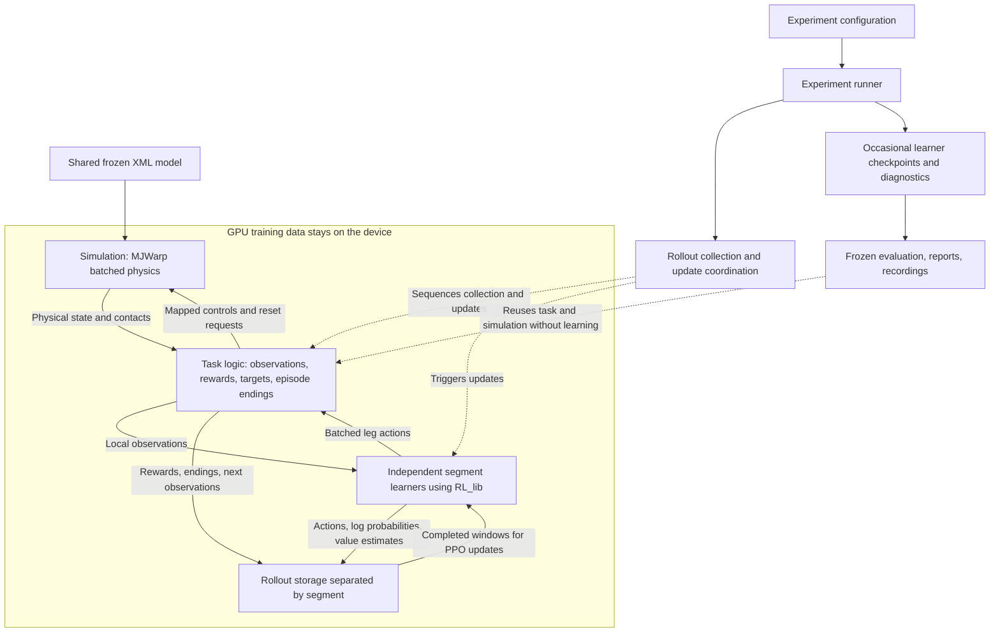

# GPU development plan

## Purpose and current position

This plan builds the GPU version of Centipede one stage at a time. The task stays
the one defined for the CPU version: eight independent segment learners, the same
partial observations, rewards, targets, and episodes. What changes is the
machinery that runs it. Physics, policy inference, and PPO updates all run on a
GPU, and substantial training is intended to run on Kaggle. The
[CPU implementation](../cpu/plan.md) remains the reference for correctness and
local debugging. The scientific goals remain cooperative walking, navigation,
and eventually a measurable wave-like gait.

The MuJoCo model is frozen as the v1 physical baseline described in
[model.md](../docs/model.md), and the shared task contract lives in
[control.md](../docs/control.md) and [environment.md](../docs/environment.md).
Stage numbers restart at 1. CPU completion does not automatically complete a GPU
stage.

### Where the work stands

**Stage 1, the batched physical simulation, is in progress.** One class exists so
far: `CentipedeSimulation` in `gpu/src/centipede_gpu/environment/simulation.py`,
with its tests in `gpu/tests/environment/test_simulation.py`. Nothing has been
trained.

| Stage 1 part | State |
| --- | --- |
| Load the shared XML and check its named contract | Done and tested |
| Copy the model to the GPU and allocate a batch of worlds | Done and tested on the MX330 |
| Write each world's leg actions into the motor controls | Done and tested, with physics replaced by a call counter |
| Advance 200 physics steps per action and stop on invalid results | Implemented; real motion not yet verified |
| Reset selected worlds with leg-only noise | Done and tested |
| Extract the physical state needed by the task | Implemented; kernels tested locally, real forward pass not yet verified |
| `gpu/pyproject.toml` package metadata | **Next increment** |
| Minimal Kaggle session running the full test suite | Not started |

Real motion cannot be verified on this computer: the MX330 fails to compile
MJWarp's collision code because that code needs more kernel-parameter memory than
this GPU provides. Nine tests pass locally and the two physics tests are
deselected; see [the verification record](README.md#setup-verification). The
Kaggle session at the end of Stage 1 closes that gap.

### Configuration names

The GPU configuration keeps four settings distinct: world count,
`rollout_window_steps` (transitions per world before an update cycle),
`max_episode_steps` (the episode limit), and `update_cycles` (the number of
collect-and-update cycles). The CPU configuration uses the same names.

### Local development and validation

Use the MX330 for allocation, mapping, device operations, and focused component
tests, and keep implementing without waiting for different hardware. Keep the
full physics test in the suite with its known local failure documented; a
selected passing subset does not mean the entire suite passes. Use
`-m "not physics"` for the supported local subset; the default command includes
motion validation. Check custom kernels with the official MJWarp analyzer as
well as compiling and exercising them on the device; see the
[kernel review](README.md#kernel-review).

Motion, contact behavior, stability, and integration checks that cannot run
locally remain unverified until they run on Kaggle. Do not alter the frozen model
or disable collisions to work around this limitation, and complete those checks
before substantial training rather than treating assumed correctness as a result.
Stage 1 therefore ends with a minimal Kaggle test run, separate from Stage 7's
training setup and scaling work.

## Principles

- Preserve the accepted task. Any physical approximation or model revision needs
  a documented comparison and explicit agreement; do not silently alter
  contacts, rewards, observations, or control timing to obtain a faster backend.
- Keep all eight learners independent: no shared networks, samples, gradients,
  losses, normalization state, or centralized critic.
- Keep physics, observations, actions, rewards, and learning arrays on the GPU
  where practical. Copy only small diagnostics and saved artifacts to the host.
  Moving only neural networks to the GPU is an intermediate step, not the goal.
- Use MJWarp and Warp APIs for everything that runs after construction:
  stepping, resets, extraction, and device-side calculations. Ordinary MuJoCo
  is used only where MJWarp requires it: loading the XML into the host model
  that `mjw.put_model` copies to the GPU, and the one-time name and metadata
  checks performed on that host model.
- Reuse `RL_lib` and extend it with generic device support rather than copying
  algorithms into this project.
- Reuse accepted CPU contracts, calculations, mappings, and tests when that
  remains simple; replace an implementation when preserving it would require
  more adapters or branching than a direct solution. Do not import the CPU
  package or create a universal backend abstraction.
- Validate mechanics and data flow before attempting learning, comparing with
  the CPU reference within justified tolerances rather than bitwise.
- Change one experimental factor at a time and retain the earlier version as a
  comparison.
- Evaluate task performance and biological gait resemblance separately.
- Treat proposals in this plan as adjustable until their stage begins and the
  user accepts them.

## Architecture

This section is the map of the complete GPU system: which pieces exist, what each
one is responsible for, and how data moves between them during training. It
describes the finished design. Only the simulation exists so far, and each
component names the stage that builds it. Keep this map current as the code
grows.

### Key concepts

The code relies on a small set of MuJoCo, MJWarp, and Warp ideas. They are
summarized here for a reader who knows reinforcement learning but not these
libraries.

**Model and data.** MuJoCo separates what never changes from what changes during
simulation. The *model* is the compiled XML: bodies, joints, masses, motors,
collision shapes, and the timestep. The *data* is the live state of a simulation:
joint positions `qpos`, joint velocities `qvel`, motor commands `ctrl`, the
simulated time, and many quantities computed from them. One model can drive many
data states.

**Joint coordinates.** `qpos` and `qvel` list every joint coordinate of the body
in one flat vector: 69 position values and 68 velocity values for the centipede.
They differ by one because the free-floating root stores its orientation as a
four-number quaternion but its rotation speed as three numbers. A named joint's
entries are looked up through the model (`jnt_qposadr` and `jnt_dofadr`), never
assumed from their order in the XML.

**Derived quantities.** World positions and orientations of bodies (`xpos`,
`xquat`), positions of marked points called sites (`site_xpos`), body velocities,
and the list of current contacts are all *computed* from `qpos` and `qvel`.
MuJoCo computes them in its *forward* pass. They are correct only after forward
has run on the current `qpos` and `qvel`.

**Physics step and transition.** One MuJoCo step advances time by the model
timestep, 0.1 ms. A policy decision is held for 200 such steps, 20 ms. This plan
calls the 20 ms interval a *transition*; reinforcement learning sees only
transitions, never individual physics steps.

**A physics step computes before it moves.** `mjw.step` first runs forward on the
current state, computing derived quantities, contacts, and forces, and then
integrates to new `qpos` and `qvel`. When it returns, positions and velocities
are new, but body positions and contacts still describe the state 0.1 ms
earlier. Observations and rewards therefore need one more forward pass on the
final state before they are read. The CPU implementation does the same with
`mj_forward` before each snapshot.

**MJWarp.** MuJoCo Warp is a GPU implementation of MuJoCo built on NVIDIA Warp.
`mjw.put_model` copies an ordinary MuJoCo model to the GPU, and `mjw.make_data`
allocates live state for many worlds at once. `mjw.step`, `mjw.forward`, and
`mjw.reset_data` then act on every world in a single call. MJWarp computes in
32-bit floating point, where CPU MuJoCo uses 64-bit.

**World.** One complete, independent centipede simulation inside the batch. Every
data array gains a leading world dimension: `qpos` has shape `(world_count, 69)`
and `ctrl` has shape `(world_count, 55)`. Worlds share the model but never share
state. A world plays the role that an environment replica played on the CPU: an
extra data collector for the same eight learners, not an extra set of policies.

**Host and device.** The *host* is the CPU with ordinary memory; the *device* is
the GPU with its own memory. A Warp array (`wp.array`) lives on one device.
Copying between them, for example with `.numpy()`, takes time and makes the CPU
wait until the GPU has finished its queued work. Training data should therefore
stay on the device, with only small results copied back.

**Warp kernel.** A Python function marked `@wp.kernel`, which Warp compiles into
GPU code. `wp.launch(kernel, dim=...)` runs it in many parallel threads, and each
thread reads its own index with `wp.tid()`. This project's kernels use one thread
per world, or one per world, segment, and action. A launch is queued and returns
immediately; the GPU runs queued work in order, and a later host copy waits for
it to finish.

**Contacts and capacities.** MJWarp stores the contacts of all worlds in one
shared pool. Each entry records the world it belongs to (`worldid`) and the two
collision shapes that touch (`geom`), and `nacon` counts the entries in use.
Buffer sizes are fixed when the data is allocated: `nconmax` sets the pool at
`world_count * nconmax` contacts, so it is a per-world average, and `njmax` limits
the solver's constraint rows in each world. MJWarp does not grow a full buffer;
it records an overflow instead.

**Overflow flags.** `data.overflow` holds one bitmask per world. A capacity bit
means contacts or constraints were dropped, so the results cannot be trusted. An
iteration-limit bit only means the solver stopped before full convergence, which
the CPU reference also tolerates. Flags stay set until that world is reset.

### Components

The boxes are responsibilities, not a requirement to create a class or file for
every box; ordinary functions are fine where they suffice. Python still
coordinates the work from the CPU. The aim is that training data stays on the
GPU, not that Python disappears.

| Component | Location and stage | Owns | Used by |
| --- | --- | --- | --- |
| Simulation | `environment/simulation.py`, Stage 1 | XML mappings, physical state of every world, control placement, integration, physical resets, contact interpretation | Task environment; tests |
| Task environment | `environment/`, Stage 2 | Partial observations, targets, rewards, contact costs, episode counters, and which worlds to reset | Rollout collection; frozen evaluation |
| Segment learners | `training/` with RL_lib, Stage 4 | One actor, critic, optimizer pair, and normalizer per segment | Rollout collection, to act and to update |
| Rollout collection | `training/`, Stage 4 | Collection windows, per-segment sample storage, bootstrap boundaries, update scheduling | Experiment runner |
| Experiment application | `experiment/` and `cli.py`, Stages 5–6 | Plan loading, runs, checkpoints, reports, frozen evaluation | The user, through the command line |

Package paths are relative to `gpu/src/centipede_gpu/`. None of these components
owns another's job: the simulation knows nothing about targets or rewards, the
task knows nothing about the physics solver or network updates, and the learners
know nothing about MuJoCo. One learner belongs to each segment position and
processes that segment's observations from every world. Different segments never
share network parameters, optimizer state, normalization statistics, samples, or
losses.

### One transition, end to end

This is the path of one 20 ms transition once all stages exist. Only the
simulation's parts, steps 3 and 4 and the reset in step 7, are implemented today.

1. The task environment holds the current observations of every segment in every
   world, built from the physical state.
2. Each segment's learner takes its own observations from all worlds as one batch
   and returns actions, log probabilities, and value estimates. Together the
   actions form one array shaped (world, segment, six leg controls).
3. The task environment passes that array to `CentipedeSimulation.step`. The
   simulation clears all 55 motor commands, writes the 48 leg actions into their
   mapped motors, leaves the seven spine motors at zero, runs 200 MJWarp physics
   steps, and stops the run on a capacity overflow or a non-finite state.
4. Before returning, `step` refreshes derived quantities and contacts with a
   forward pass and fills `simulation.physical_state` with the fields defined in
   [environment.md](../docs/environment.md#physical-snapshot). This is Stage 1's
   next increment.
5. The task environment compares the current physical state with the two
   previous-value arrays it copied before the step, calculates every segment's
   reward, checks arrival and the time limit, and builds the next observations.
6. Rollout collection stores each segment's observation, action, log probability,
   value, reward, and episode-ending signals in that segment's own storage.
7. For worlds whose episodes ended, the task environment keeps the final
   observations for bootstrapping, calls `CentipedeSimulation.reset` with a mask
   selecting only those worlds, samples new targets, and builds their reset
   observations. The other worlds continue unchanged.
8. After `rollout_window_steps` transitions, every learner updates from its own
   samples. This window cutoff does not reset any world.

### Framework composition

MuJoCo Warp is the physics backend being implemented. It is evaluated first
because it targets NVIDIA GPUs and works alongside PyTorch; MJX remains an
alternative if compatibility or performance warrants it. The choice is confirmed
only by the Stage 1 motion checks and the Stage 7 measurements. A large connected
centipede may scale differently from small independent bodies, and parallel
worlds make GPU batching relevant without guaranteeing either compatibility or a
particular speedup.

#### The simulation class

`CentipedeSimulation` owns one compiled model and the GPU state of a batch of
independent worlds. It is a physical simulation, not a Gymnasium or PettingZoo
task wrapper, and rendering is an optional later service that must not shape the
training layout. Its public surface is small:

| Member | What it does | Who uses it |
| --- | --- | --- |
| Constructor `(model_path, world_count, *, nconmax, njmax, device)` | Loads the XML on the host, checks the named contract once, copies the model to the GPU, allocates `world_count` worlds, and prepares the device mapping arrays and one random stream per world | Experiment runner at startup (Stage 5); tests today |
| `host_model` | The ordinary MuJoCo model on the CPU, used for name lookups and checks | The class itself; tests |
| `model`, `data` | The MJWarp model and batched live state on the GPU | The class itself; physical-state extraction; later rendering |
| `segment_ids` and the ID tables | Named elements resolved once: leg actuators `(8, 6)`, spine actuators `(7,)`, leg `qpos`/`qvel` positions, and body, site, and collision-shape IDs | The class's kernels; extraction |
| `action_shape`, `dt` | `(world_count, 8, 6)` and 0.02 s | Task environment and learners, to size arrays and measure time |
| `reset(reset_mask=None, *, seed=None)` | Restores the selected worlds to the XML pose with small leg-only noise | Task environment, at start and when episodes end |
| `step(leg_actions)` | Holds one batch of leg actions for 200 physics steps | Task environment, once per transition |
| `physical_state` | A `PhysicalState` of fixed device arrays, refreshed at the end of every `step` and `reset` | Task environment, to build observations and rewards |

Four private kernels do the GPU-side work inside the class:

- `_write_leg_controls` runs one thread per world, segment, and action and copies
  that action into its mapped motor slot in `data.ctrl`.
- `_initialize_reset_random_states` gives every world its own random stream at
  construction, so worlds draw independent noise.
- `_randomize_reset_legs` runs one thread per world, skips unselected worlds, and
  adds the leg-angle and leg-velocity noise after MJWarp's own reset.
- `_find_nonfinite_worlds` flags any world whose positions, velocities, or
  accelerations contain NaN or infinite values after a transition.

MJWarp's public functions own integration and physical reset; the project
kernels only place commands, add reset noise, and check results.

#### Differences from the CPU implementation

- **No PettingZoo or Gymnasium environment is required.** MJWarp handles batched
  physics, and a small task interface owns the project's rules.
- **No CPU worker pool or pipes are needed.** A world is an independent
  simulation inside one batch, not a separate Python process.
- **No copied NumPy snapshot per world is required.** The physical fields keep
  their meaning, but their batched device representation is decided in Stage 1
  before anything uses it.
- **The feedback loop is unchanged:** observe, choose actions, advance physics,
  and calculate rewards. MJWarp does not define the partial observations or
  rewards.
- **Training checkpoints remain occasional saves** of learner state for
  continuation and evaluation. They are neither physical snapshots nor an
  intermediary between the policy and the simulation.

### Validation ownership

Validate external inputs once at their owning boundary, then trust internal
values. Experiment configuration loaded from TOML is the runtime validation
boundary; the simulation, task, and training layers trust the arguments and
arrays passed between them and do not test invalid-argument cases.

| Input or invariant | Single owner | When it is checked |
| --- | --- | --- |
| Experiment configuration, including device and capacities | Configuration loader | Once, before constructing the experiment |
| XML actuator names, ownership metadata, attached joints, control ranges, and contact metadata | `CentipedeSimulation` | Once, during construction |
| MJWarp capacity overflows and non-finite physical state | `CentipedeSimulation` | After every transition |
| Policy actions | Trusted: tanh-bounded policy outputs, neither checked nor clipped | Not checked |
| PPO samples, shapes, and update requirements | `RL_lib` | At its public library boundaries |

Simulation failures and capacity overflows stop the run; they are never hidden
as ordinary episode endings or silently reset. Solver iteration-limit flags only
mark incomplete convergence and are not errors. GPU-specific type or precision
changes require an explicit contract; existing class and field names remain
where their meaning fits.

The `gpu/tests/` directory owns automated verification. The `physics` marker
identifies tests that integrate the complete frozen model on a compatible GPU.

### State and data ownership

- The experiment entry point loads the selected configuration once. Constructed
  components receive only the values they need.
- The simulation owns the device state of every world. Reset uses a boolean
  device mask, and each world has a persistent device random stream for leg
  noise, seeded together with its stable world index. Target sampling uses a
  separate random stream.
- Physical fields keep their shared meaning without a copied snapshot per world.
  Previous-step values are preserved where rewards or stored transitions need
  them; live device views must not accidentally overwrite that history.
- The task owns episode counters and reset decisions. Only worlds whose episodes
  end are reset, and final observations remain available for bootstrapping
  before reset observations replace them.
- A collection-window cutoff triggers an update but does not reset a physical
  episode.
- Each learner owns its normalization state and rollout samples for its segment
  across all worlds.
- Checkpoints save all segment learners and the state needed for continuation.
  They exclude live physical state; exact live-trajectory restoration is not
  implied.

### RL_lib integration

Audit and reuse `RL_lib/src/rl_lib` in Stage 4 before writing helpers. The
[CPU audit](../cpu/plan.md#rl_lib-integration) found that the package has no
explicit CPU/CUDA device selection. Extend RL_lib with the generic capabilities
required for device-aware models, policy sampling, PPO batches and updates,
normalization, random generators, and checkpoint restoration, after agreeing on
the scope. Centipede continues to own the task, world routing, experiment
runner, and reporting; it does not copy algorithms or import RL_lib's
experiment runners.

## Stages

Each stage has one goal and a scope: the layer and files it creates or changes.
Package paths are relative to `gpu/src/centipede_gpu/`. File names for later
stages are expected locations, not scaffolding to create early.

### Stage 1 — Batched physical simulation

**Goal:** make the program able to create, advance, reset, and read batches of
centipede worlds on the GPU.

**Scope:** the physical layer. `environment/simulation.py` and
`gpu/tests/environment/test_simulation.py`, plus the package metadata and
dependencies in `gpu/pyproject.toml` so the same installation works locally and
on Kaggle. `gpu/pyproject.toml` replaces the path setting in `gpu/pytest.ini`.

This stage produces the bottom layer of the [component map](#components): the
only code that touches MJWarp. Every later layer reaches the physics through the
constructor, `reset`, `step`, and physical-state extraction, as described in
[the simulation class](#the-simulation-class).

#### Done

- **Loading and the named contract.** The constructor loads the shared XML with
  ordinary MuJoCo on the host and resolves every actuator by name: the six leg
  motors of each segment in the accepted action order and the seven spine-yaw
  motors. It checks each motor's owning segment, attached joint, and `[-1, 1]`
  control range, requires all 55 motors to be mapped exactly once, and checks the
  contact owner and category stored on every collision shape. These checks run
  once and are trusted afterwards.
- **Batched GPU state.** The model is copied to the GPU and live state is
  allocated for `world_count` worlds. Contact and constraint capacities are
  required constructor settings, because MJWarp's defaults for this model (48
  contacts and 64 constraint rows per world) are below the CPU reference peak of
  256 constraint rows.
- **Stepping.** `step` holds one batch of leg actions for 200 physics steps of
  0.1 ms, giving the 20 ms transition. Spine motors receive zero commands, which
  does not lock the spine. After the transition it stops the run on any capacity
  overflow or non-finite position, velocity, or acceleration. That check copies a
  small array to the host every transition, a deliberate correctness-first
  synchronization rather than the final optimized path.
- **Selective reset.** `reset` takes a boolean device mask, or None for all
  worlds. MJWarp's `reset_data` restores the selected worlds to the XML pose and
  clears their time, controls, applied forces, and solver history. A project
  kernel then adds the accepted leg-angle and leg-velocity noise to those worlds
  only. Each world has its own random stream: a supplied unsigned 32-bit seed
  restarts the selected streams, and without a seed they continue. GPU samples
  need not match NumPy's CPU samples bit for bit. Reset does not advance time.
- **Physical-state extraction.** Implemented as agreed under
  [Extraction decisions](#extraction-decisions). Every `step()` and `reset()`
  ends with `mjw.forward`, the finiteness check, the per-segment kernel
  `_extract_segment_state`, and the contact kernel `_classify_contacts`, then
  checks overflow and finiteness on the host. Locally, the kernels are verified
  against CPU MuJoCo's derived quantities and a hand-written contact pool, also
  with Warp's bounds-checked debug builds; the comparison with MJWarp's real
  forward pass is a `physics` test for the Kaggle session.

#### Remaining

1. **`gpu/pyproject.toml`**, so the package and its pinned dependencies install
   the same way locally and on Kaggle.
2. **A minimal Kaggle session** that installs the package and runs the full test
   suite on a compatible GPU. It is not yet a training setup. Choose a GPU of the
   Volta generation or newer: the larger kernel-parameter allowance that MJWarp's
   collision code needs starts there. Kaggle has offered a Tesla P100 (Pascal,
   compute capability 6.0), which shares the MX330's limit and would fail the
   same way, and a Tesla T4 (Turing, 7.5), which should not. Confirm the options
   and the reported compute capability in the session itself.

   The same session takes a first timing measurement, before any optimization,
   to inform the Stage 7 candidates. It is a diagnostic, not a training run:
   - MJWarp's own benchmark, `mjwarp-testspeed models/assembly.xml`, with the
     test world count and capacities (for example `--nworld 32 --nstep 200
     --nconmax 128 --njmax 512`). It replays one captured physics step as a
     CUDA graph and reports steps per second. Adding `--event_trace` breaks the
     time into phases such as collision and constraint solving, and
     `--measure_alloc` and `--measure_solver` report contacts, constraint rows,
     and solver iterations per step, which also check the capacities. Run the
     throughput measurement once without tracing, because the trace adds its
     own timing events.
   - One transition of `CentipedeSimulation.step()`, timed as written: 200
     uncaptured steps from Python plus the host check. Comparing it with 200
     graph-replayed steps from the benchmark estimates the launch and
     synchronization overhead that candidates 1 and 2 of Stage 7 would remove.

   Record the GPU, versions, world count, and results in the
   [verification record](README.md#setup-verification). Model-level candidates
   are judged from these numbers, not assumed.

#### Extraction decisions

All five were agreed on 2026-09-29, one at a time, before extraction is
implemented.

**Representation (agreed).** Extraction provides one device array per physical
field, grouped in a small container, rather than exposing MJWarp's `data` to
the task or packing everything into observation-shaped rows. Field names match
the CPU `PhysicalSnapshot` so that Stage 3 can compare them field by field. `W`
is the world count and 8 the segment count; float fields have explicit trailing
dimensions rather than Warp vector types, so they read like NumPy arrays and
keep their shape when shared with PyTorch.

| Field | Shape | Type | Meaning |
| --- | --- | --- | --- |
| `body_height` | `(W, 8)` | float | Height of each segment center |
| `body_quaternion` | `(W, 8, 4)` | float | Body orientation, `(w, x, y, z)` |
| `leg_joint_position` | `(W, 8, 6)` | float | Leg angles in action order |
| `leg_joint_velocity` | `(W, 8, 6)` | float | Leg angular velocities in action order |
| `body_linear_velocity` | `(W, 8, 3)` | float | Center velocity in the segment frame |
| `body_angular_velocity` | `(W, 8, 3)` | float | Angular velocity in the segment frame |
| `body_planar_position` | `(W, 8, 2)` | float | World `x`, `y` of each center; rewards only |
| `left_foot_ground_contact` | `(W, 8)` | bool | Final-state contact flag |
| `right_foot_ground_contact` | `(W, 8)` | bool | Final-state contact flag |
| `body_ground_contact` | `(W, 8)` | bool | Final-state contact flag |
| `leg_leg_contact` | `(W, 8)` | bool | Final-state contact flag |
| `head_tip_position` | `(W, 3)` | float | World position of the `head_tip` site; rewards and targets only |

The simulation keeps all MuJoCo knowledge: element IDs, forward timing, and the
contact pool. The task converts flags to `0.0`/`1.0` observation values itself.
MJWarp stores orientations in Warp's quaternion type but in MuJoCo's
`(w, x, y, z)` component order, while Warp's built-in quaternion functions
assume `(x, y, z, w)`; extraction copies the four components in MuJoCo order and
never applies Warp's quaternion helpers to MJWarp orientations.

**Precision (agreed).** Every float field is 32-bit, matching MJWarp's state,
the float32 observation contract, and PyTorch's default; flags stay boolean
and ID tables 32-bit integers. The GPU pipeline performs no float64
conversions, which could not restore digits already lost. At the centipede's
scale this is sufficient: float32 resolves about 2 nm at 20 mm and 0.1 µm at
1 m, far below the 1 µm reward guard and the 1 mm arrival radius.

MJWarp's `data.time` is not used for timing. It accumulates the 0.1 ms timestep
in float32, and repeating that addition for one 8,192-transition episode gives
165.31 s instead of 163.84 s. The task counts transitions with integers and
derives time as count × 0.02 s. Stage 3 compares GPU and CPU values from matched
states over short horizons, with tolerances justified by float32 rather than
widened until tests pass. The known float32 consequences listed under the
Kaggle motion checks remain to be verified there.

**Buffer lifetime (agreed).** The container is named `PhysicalState`, because it
is a live view rather than a frozen copy. The simulation allocates one instance
in its constructor as `physical_state` and overwrites it in place. Allocating new
arrays every transition would add constant allocation work and rule out the
CUDA graphs considered in Stage 7, which require arrays that never move. Two
alternating copies inside the simulation would put reward history in the
physical layer.

Extraction is not a separate public call. Every `step()` and `reset()` ends by
running `mjw.forward` on the final state, checking capacity flags, and filling
`physical_state`, so a stale state cannot be read by forgetting a refresh. The
rule for readers is:

> After `step()` or `reset()` returns, `physical_state` describes the current
> state of every world and stays valid until the next `step()` or `reset()`.
> Readers never write to it and copy anything they need to keep longer.

History belongs to the task. Rewards and head diagnostics use only two previous
fields, as in the CPU `rewards.py`, so the task keeps
`previous_body_planar_position` `(W, 8, 2)` and `previous_head_tip_position`
`(W, 3)`, filled with `wp.copy` at the start of each transition before calling
`step()`. A world reset at the end of one transition therefore enters the next
with its reset pose as the previous state, as
[environment.md](../docs/environment.md#seeded-physical-reset) requires.

`physical_state` is meaningful only after the first `reset()`, which the task
always performs first. `reset(mask)` refreshes every world, because
`mjw.forward` has no world mask; unselected worlds are recomputed from unchanged
state and keep identical values. The extra pass occurs only on transitions where
some episode ends.

**Contact flags (agreed).** The four flags reproduce the CPU
`_classify_contacts` rules exactly, using the owner and category stored on each
collision shape:

| Contact between | Sets |
| --- | --- |
| Floor and a segment's body | `body_ground_contact` for that segment |
| Floor and a segment's left or right foot | That side's foot-ground flag |
| Floor and a leg part that is not a foot | Nothing |
| Two leg or foot parts, including both legs of one segment | `leg_leg_contact` for both owners |
| A leg and a body | Nothing |

The v1 model has no collision sensors and a zero contact margin, so every pool
entry is a physical contact, as on the CPU. At construction the simulation
copies the validated shape owners, shape categories, and foot shape IDs to the
device once. Extraction clears the four flag arrays and launches one project
kernel with one thread per contact-pool slot. A thread whose slot is at or
beyond `nacon` exits immediately; otherwise it reads its contact's `worldid`
and two shape IDs and sets the matching flags in that world's row. Copying the
pool to the host would synchronize every transition, and one thread per world
would scan the whole pool in every thread.

The launch size is the fixed pool capacity because `nacon` lives on the device:
reading it on the host to size the launch would force the CPU to wait, while a
fixed launch keeps CUDA graphs possible. MJWarp's own constraint kernels use
the same exit test. Several threads may set the same flag, but all store
`True`, so no atomic operation is needed. A pool overflow stops the run through
the capacity check, so flags are never silently incomplete, and MJWarp's
single contact per capsule-mesh pair does not affect flags that record only
whether two shapes touch.

**Local body velocity (agreed).** The CPU version uses MuJoCo's
`mj_objectVelocity` at each segment's center site, which MJWarp's public API
does not provide. After a forward pass, `data.cvel` holds each body's angular
velocity `ω` and a linear velocity `v` measured at a shared reference point,
`data.subtree_com` of the body's root, both in world axes. A rigid body turns as
one piece, so the velocity at the center site is `v + ω × (center − reference)`,
which equals `v − (center − reference) × ω`. Both vectors are then rotated into
the segment's axes with the transpose of the site orientation `data.site_xmat`.
The center sites carry no rotation of their own, so site axes and segment body
axes coincide.

A project kernel with one thread per world and segment computes
`angular = rotᵀ · ω` and `linear = rotᵀ · (v − (center − reference) × ω)` from
public MJWarp fields, finding the body and reference through the model's
`site_bodyid` and `body_rootid`. It uses Warp's vector and matrix operations,
which involve no quaternions. This is the same formula as MuJoCo's
`mj_objectVelocity` and MJWarp's private `_velocimeter` and `_gyro` sensor
functions, so differences from the CPU should come only from float32.

Adding gyro and velocimeter sensors to the XML was considered. A CPU check with
16 such sensors added in memory left positions, velocities, and accelerations
bit-identical over 600 physics steps, and the sensor readings equaled
`mj_objectVelocity` exactly, so sensors would not have altered the physics.
They were not adopted because their advantage was small: MJWarp would evaluate
them in every one of the 200 forward passes per transition, the flat
`sensordata` array would still need a copy step, and the frozen model's
fingerprint and documentation would change. Importing MJWarp's private sensor
functions was rejected because private functions can change without notice,
and differencing positions was rejected because it gives a 20 ms average rather
than the final velocity.

With these five decisions, extraction at the end of every `step()` and
`reset()` consists of MJWarp's forward pass and capacity check, per-segment work
filling the float fields including these velocities, and the contact
classification kernel. Whether the per-segment work is one kernel or several is
an implementation detail that changes no agreed contract.

**Testing consequence.** `mjw.forward` runs collision detection, so it hits the
same MX330 compile limit as `mjw.step`. Because `reset()` will end with a
forward pass, the reset tests that pass locally today would then fail on the
MX330. Locally, those tests and the extraction kernels can be exercised by
replacing `mjw.forward` with a call counter, as the control test already does
for `mjw.step`, and by writing chosen values into MJWarp's `data` fields and
contact pool before launching the project kernels. Such tests check the
project's own kernels, not physics. Comparisons of extracted values with the
CPU reference carry the `physics` marker and run in the Kaggle session.

#### Motion checks for Kaggle

Loading successfully settles none of these: MJWarp's 32-bit state, its clamping
of the solver tolerance from `1e-10` to `1e-6`, the capsule-mesh pairs that
produce at most one contact each instead of several, and whether the contact and
constraint capacities are sufficient in motion.

**Complete when:** the package installs locally and on Kaggle, and the full test
suite on a compatible GPU verifies timing, control placement, isolated world
state, selective resets, physical-state extraction, finite motion, and no
capacity overflow. Short physical checks of joint states, body poses, and
contact flags are compared with the CPU reference using tolerances, not exact
bits.

**Status:** in progress. Loading, mapping, stepping, resets, and physical-state
extraction are implemented and tested as far as the MX330 allows.
`gpu/pyproject.toml` is next, followed by the Kaggle test run and measurement.

### Stage 2 — Batched task environment

**Goal:** turn the physical simulation into the same learning task as the CPU
version.

**Scope:** the task layer in `environment/`: partial observations, targets,
rewards, contact-based costs, and episode counters and endings, with focused
tests of each calculation.

Reuse the meaning and mathematics of local observations, head-relative targets,
rewards, contact flags, arrival conditions, and time limits. Implement them over
batches, behind a small ordinary task interface rather than PettingZoo wrappers.
Target sampling uses its own random stream. Only worlds whose episodes end are
reset. Keep final observations available for bootstrapping before reset
observations replace them.

**Complete when:** reset and step produce correctly associated observations,
rewards, termination and truncation signals for every segment in every world,
and hand-constructed cases confirm each calculation.

**Status:** not started.

### Stage 3 — Task consistency with the CPU reference

**Goal:** establish that the GPU task preserves the intended experiment.

**Scope:** verification only, in `gpu/tests/environment/`: task-level
comparisons with the CPU reference and isolation checks between worlds. It
changes production code only to fix discrepancies it finds.

Adapt the relevant controlled CPU cases for observations, reward terms, contact
ownership, history, and episode endings. Compare observations, rewards, resets,
terminations, truncations, and bootstrap boundaries with the CPU implementation
from matching physical states, within justified tolerances. Keep tests focused
on individual responsibilities rather than building a second environment in
tests.

**Complete when:** tested differences are explained, and batching or resetting
one world cannot contaminate another world's task state. This is a correctness
gate, not evidence of learning.

**Status:** not started.

### Stage 4 — Independent learners and batched collection

**Goal:** collect GPU experience and update each segment's learner correctly.

**Scope:** the training layer in `training/`: learner construction, batched
rollout collection, and bootstrap handling, plus any agreed generic device
support added to `RL_lib/src/rl_lib`.

Complete the RL_lib audit described under [RL_lib integration](#rl_lib-integration)
and discuss any missing generic device support in the library instead of copying
PPO into this project. Adapt collection, normalization, and bootstrap handling
to the batched task. Retain separate data and optimization for each segment.

**Complete when:** short integration tests exercise collection and updates with
finite results, correct sample ownership, and correct handling of terminals,
time limits, and collection cutoffs. A cutoff does not reset a physical episode.

**Status:** not started.

### Stage 5 — Runnable experiment and recoverable saves

**Goal:** run a small complete experiment from a TOML preset through the
command line.

**Scope:** the experiment application in `experiment/`: plan loading, workflows,
the training runner, and checkpoint saving and loading; `cli.py` and
`__main__.py`; and `gpu/configs/smoke.toml`.

Plan loading is the runtime validation boundary: it loads and checks every TOML
plan, including device, capacities, and the
[configuration names](#configuration-names) above, and passes trusted plans to
the other layers. Reuse useful CPU configuration, progress, checkpoint, and
reporting conventions without importing CPU application modules. Keep reusable
configuration files by purpose rather than creating one per run. Checkpoints
save all segment learners and the state needed for continuation, including
optimizers, normalizers, random states, and update counters; exact
live-trajectory restoration is not required and must not be implied.

The command line mirrors the CPU implementation's
[plan-file design](../cpu/plan.md#stage-9--plan-file-command-line): one
command, `centipede-gpu PLAN.toml` or `python -m centipede_gpu PLAN.toml`, whose
plan file states its `kind` and holds every setting:

| `kind` | Operation |
| --- | --- |
| `training` | Train a new run; its optional `[evaluation]` seeds evaluate that run afterwards |
| `evaluation` | Evaluate an existing `source` run with its saved training settings |
| `comparison` | Train, and optionally evaluate, every variant of a `base` training plan and report them together |

A comparison uses a `[grid]` of values or explicit `[[variant]]` tables, and
every variant is checked before the first run starts. The plan sections match
the CPU layout; only implementation-specific fields differ, such as world count,
device, and contact and constraint capacities instead of worker count. The GPU
entry point stays separate from the CPU one, because each implementation runs in
its own environment and loads its own package. `gpu/pyproject.toml` installs the
console script, so the environment that installs the package, locally or on
Kaggle, also supplies the interpreter. The CLI only loads the plan and passes it
to the workflow for its kind.

**Complete when:** a user-launched smoke run collects data, updates learners,
saves a resolved configuration and valid checkpoints, and can continue from a
save under a documented fresh-episode or live-state policy.

**Status:** not started.

### Stage 6 — Frozen evaluation and visible behavior

**Goal:** make checkpoint behavior understandable before scaling training.

**Scope:** frozen evaluation, baselines, human-readable reports, and short
policy recordings in `experiment/`, the `evaluation` plan kind, and
`gpu/configs/evaluation.toml`.

Reuse evaluation without learning, held-out seeds, zero/random baselines, and
human-readable summaries. Record per-segment contact and support behavior as
well as target progress and returns. GPU evaluation should test the training
task; CPU playback is optional and requires compatible observations and
controls, not an assumption of identical dynamics.

**Complete when:** a saved learner bundle can be evaluated and compared with
baselines without changing learned parameters or normalization statistics.
Report whether improvement is observed; a working report alone proves neither
learning nor walking.

**Status:** not started.

### Stage 7 — Kaggle training setup and measured scaling

**Goal:** choose a practical GPU training configuration from actual measurements.

**Scope:** the Kaggle training notebook, comparison plans for execution
settings, persistent output handling, and the measurements recorded in this
plan.

Extend the Stage 1 Kaggle session into a training setup: obtain Centipede and
the selected RL_lib revision, install compatible dependencies, and invoke the
command-line entry point with a reusable preset. Keep project implementation in
its packages. Configure writable output paths and record package versions, GPU
identity, memory, and session constraints on the actual Kaggle runtime rather
than assuming a fixed hardware allocation. Verify saving results outside the
temporary session and continuation across sessions.

Measure compilation and startup separately from steady collection and update
time, memory usage, and CPU/device transfer costs. Compare with the CPU reference
of roughly 50 transitions per second on comparable workloads. Use library
facilities such as CUDA graphs where measurement justifies them; do not promise a
speedup before measuring it. If the backend does not provide a useful gain,
diagnose or revise the migration before claiming completion.

One transition is 200 physics steps and one extraction, so almost all time is
spent in the physics loop; per-transition task work is a small fraction.
Measure first, then consider these candidates in order, from those that change
no science to those that do:

1. **CUDA graph capture of the 200-step loop.** Each `mjw.step` launches many
   small kernels, so a transition issues thousands of launches from Python, and
   with few worlds the GPU waits for the CPU. Warp can record the loop once with
   `wp.ScopedCapture` and replay it with `wp.capture_launch`, as MJWarp's own
   benchmark does. The fixed buffers and fixed launch sizes agreed in Stage 1
   make this possible. It changes no result.
2. **Device-side failure record.** `step()` copies overflow flags to the host
   every transition, which forces a synchronization. A device array could
   instead record every world that ever failed, read once per rollout window.
   The run still stops on failure, only later. Because `reset_data` clears
   MJWarp's flags, the record must be updated before any reset.
3. **More worlds.** Worlds run in parallel, so extra worlds cost little until
   the GPU is saturated, and MJWarp targets thousands. Samples per update grow
   with them, so `rollout_window_steps` and other PPO settings must be
   re-agreed rather than carried over.
4. **Batched segment networks.** Each 64-by-64 network is too small to occupy a
   large GPU. The eight networks could be evaluated as one batched operation
   while keeping separate parameters, optimizers, and samples, which is
   mathematically identical to eight separate networks. This needs agreed
   RL_lib support, and the different input sizes (56, 81, 54) complicate it.
5. **Model-level changes.** These would form a new, separately named and
   validated model version, never an edit of v1, and they change the physics:
   - *Collision shapes.* The eight segment bodies are the model's only meshes.
     Every mesh pair uses MJWarp's general convex collision code, the same code
     that exceeds the MX330's kernel-parameter limit, while capsule, sphere,
     and plane pairs use dedicated routines. Bodies built from primitive shapes
     might collide faster; this is an unverified hypothesis, and the body shape
     also carries the model's appearance and inertia.
   - *Timestep.* The 0.1 ms step multiplies all physics work by 200 per action,
     but the 0.3 ms contact response time must span at least two physics steps,
     so without softer contacts the step could grow by at most 1.5 times.
   - *Solver settings.* Up to 80 solver and 50 line-search iterations with
     elliptic friction cones are spent in every physics step.

Candidates 1 and 2 change no result and come first. Revisit the model only if
measurements show that the substantial-training budget is infeasible on the
available GPU after candidates 1 to 3.

Agree on world count, rollout window steps, episode limit, and update cycles
here rather than copying a CPU comparison winner or treating the episode limit as
the total learning budget.

**Complete when:** a user-launched cloud smoke run works and measurements support
a feasible configuration and budget for substantial training.

**Status:** not started.

### Stage 8 — Whole-body standing

**Goal:** learn supported posture throughout the centipede. Standing is a
distinct milestone and does not count as walking.

**Scope:** a training preset for the posture run, body-clearance and
foot-support diagnostics added to evaluation, and the recorded results.

Use the measured training setup and a materially larger experience budget. The
CPU comparison showed that 64-step windows created more posture-related
improvement than 256-step windows within the same small budget; this shows
sensitivity to update opportunity, not that 64 is the final window. The first
scaled run returns to 256-step windows and increases total experience instead.
The earlier CPU budget below is an illustrative reference, not an approved run:

| Setting | Proposed value | Meaning |
| --- | ---: | --- |
| Worlds | 32 | Independent simulated worlds |
| `rollout_window_steps` | 256 | Transitions per world before an update cycle |
| `max_episode_steps` | 8,192 | Episode limit, equal to 163.84 simulated seconds |
| `update_cycles` | 128 | Complete collect-and-update cycles; provisional |

This example yields 8,192 transitions per update and 1,048,576 in total. Episodes
continue across update cycles and reset on arrival or truncation, so episode
count is an outcome rather than the training budget. Keep the v1 model, close
forward target, reward, inactive spine commands, observation radius, and 64-by-64
learner architecture fixed for the first scaled posture run. Set measurable
acceptance thresholds before the experiment.

Evaluate every saved checkpoint on fixed held-out seeds with zero and random
baselines. Use the body-clearance and foot-support diagnostics, plus a few
frozen-policy recordings, so reduced contact cannot be mistaken for hanging,
rolling, sliding, or unstable flailing. If the gate fails, diagnose the
measurements and change only one reward, network, or training factor in the next
controlled run.

**Complete when:** the head, representative middle segments, and rear maintain
body clearance with plausible foot support across held-out episodes and
recordings, and a repeat run with another training seed supports the
conclusion. Improvement confined to one end is not sufficient. Target progress
is recorded but not required.

**Status:** not started.

### Stage 9 — Sustained walking toward the close target

**Goal:** convert supported posture into sustained connected-body locomotion
toward the existing nearby forward target.

**Scope:** training presets for the walking runs, locomotion diagnostics in
evaluation, and the recorded results.

Keep the accepted Stage 8 setup as the baseline. Decide explicitly whether each
experiment starts from scratch or resumes a posture checkpoint, and do not mix
those conditions in one comparison. A valid continuation restores learner
models, optimizers, normalizers, random state, and training position rather than
merely loading evaluation weights.

Initially keep the target distribution and reward unchanged. Compare checkpoints
on common held-out seeds using segment displacement, head path length, net target
progress, arrivals, time to target, contact rates, and recordings. Distinguish
coordinated walking from falling, sliding, rolling, or throwing only the head. If
posture remains stationary, test one diagnosed curriculum or other isolated
change; do not silently prescribe a gait or add several reward terms.

**Complete when:** several connected segments produce repeatable sustained
locomotion, and the head makes meaningful progress toward close forward targets.
Reliable arrival, turning, and a biological wave are not yet required. Contact
reduction or isolated head motion alone does not pass.

**Status:** not started.

### Stage 10 — Navigation curriculum

**Goal:** extend established locomotion to targets that require turning and
longer travel without destroying the walking baseline.

**Scope:** target-distribution settings in the task configuration, curriculum
presets, and the recorded results.

Change target difficulty one factor at a time, retaining each predecessor as a
fixed-seed comparison and agreeing on success thresholds beforehand:

1. Widen the forward bearing beyond ±15 degrees.
2. Permit targets anywhere around the body, including behind the head.
3. Increase distance beyond the current 10–20 mm range.
4. Spawn a new target after arrival without resetting the simulation.
5. Broaden initial-pose randomness only if robustness requires it.

Do not advance until the failure modes of the current step are understood.

**Complete when:** the centipede approaches targets across the agreed wider
bearing and distance ranges, turns toward targets behind the head, and pursues a
replacement target after arrival. Report these abilities separately rather than
hiding them inside one aggregate score.

**Status:** not started.

### Stage 11 — Wave-like gait

**Goal:** measure whether a propagating leg wave emerges from cooperative
navigation, and test an explicit gait objective only if the natural result is
insufficient.

**Scope:** gait-measurement diagnostics in evaluation, recordings, and, only if
needed, one isolated gait objective in the task rewards.

First evaluate the navigation policy without a gait reward. Measure:

- Phase differences between neighboring legs.
- Direction, speed, and consistency of phase propagation along the body.
- Step frequency, duty factor, and left-right coordination.
- Locomotion speed, stability, arrivals, and contact rates.
- Action magnitude or estimated effort per unit distance.

Use quantitative traces together with recordings; visual resemblance alone is
not evidence of a propagating wave. If the navigation-only policy lacks a clear
wave, introduce one isolated gait objective and compare it with the unchanged
navigation baseline, preserving the distinction between emergent cooperation and
motion imposed by reward design.

**Complete when:** the measured phase pattern and whether it propagates
consistently along the body are reported. If an explicit gait objective is
tested, its controlled effect on gait, navigation, stability, and effort
relative to the navigation-only baseline is reported. Failure to obtain a wave is
a result to report, not a reason to label arbitrary movement a wave.

**Status:** not started.

### Stage 12 — Control and information variants

**Goal:** determine whether more body control or local information improves an
already functional walking and navigation system.

**Scope:** one configuration and comparison per variant, with the task and
policy-interface changes each variant requires. The frozen v1 model and the
first-version task contract are not overwritten.

Evaluate separate controlled variants for:

1. Active spine-yaw actions with corresponding observations.
2. Commanded, passive, and fixed spine behavior.
3. Neighbor observation radii greater than one.
4. A short observation history or recurrent policy, only if partial
   observability is demonstrated as a limitation.

Every variant receives its own configuration, measurements, and comparison with
the simpler accepted baseline.

**Complete when:** every adopted variant answers its stated question through a
controlled result. Retain only changes with a demonstrated benefit or useful
scientific finding; additional complexity is not assumed to be better.

**Status:** not started.

## Maintaining this plan

Update the current position and each stage's status as decisions are made and
checks pass. Record each stage transition explicitly, and do not mark a stage
complete because code exists; record the checks that demonstrate its completion.
Stage 1 implementation is not finished until extraction is covered, and its
motion-validation gate remains pending for Kaggle even if later independent work
proceeds locally. Do not scaffold later-stage modules early. The user launches
all training, comparison, and full evaluation runs.

Detailed model, control, and task decisions remain in the shared documents.
Preserve existing domain terminology, and review changes to data
representations explicitly rather than silently rewriting a shared meaning.

## References

- [MJWarp API](https://mujoco.readthedocs.io/en/latest/mjwarp/api.html)
- [MJWarp behavior and performance notes](https://mujoco.readthedocs.io/en/latest/mjwarp/index.html)
- [MuJoCo MJX](https://mujoco.readthedocs.io/en/latest/mjx.html), an alternative
  GPU-physics backend
- [Warp 1.17 runtime guidance](https://nvidia.github.io/warp/v1.17/user_guide/runtime.html)
- [Kaggle notebooks](https://www.kaggle.com/docs/notebooks), the intended cloud
  execution environment
